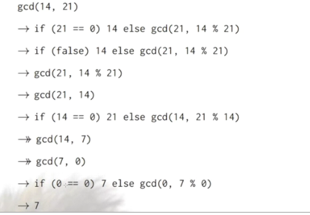
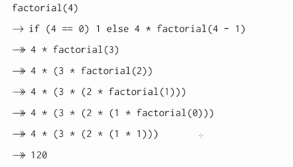

# 1.7 Tail Recursion (Хвостовая рекурсия)

Частный случай рекурсии, при котором любой рекурсивный вызов является последней операцией перед возвратом из функции. Подобный вид рекурсии примечателен тем, что может быть легко заменён на итерацию путём формальной и гарантированно корректной перестройки кода функции. Оптимизация хвостовой рекурсии путём преобразования её в плоскую итерацию реализована во многих оптимизирующих компиляторах. В некоторых функциональных языках программирования спецификация гарантирует обязательную оптимизацию хвостовой рекурсии. 


```scala
// наибольший общий делитель двух чисел
def gcd(a: Int, b: Int): Int = 
	if (b==0) a else gcd(b, a % b)

```

Эта функция развернётся вот так:




```scala
// факториал
def factorial(n: Int): Int =
	if (n==0) 1 else n * factorial(n-1)

```

Факториал развернётся следующим образом:




*В чём разница между этими двумя последовательностями?* В Факториале с каждым следующим шагом мы добавляем больше элементов к вызову factorial, когда как gcd всегда вызывается одинаково с разными параметрами. 

Если рекурсивная функция вызывает себя как последнее действие - стек этой функции может быть переиспользован. Это называется **хвостовая рекурсия**. 

Факториал после вызова самого себя делает умножение: `n * factorial(n-1)`. По методу подстановки сначала вычисляется factorial, а потом производится умножение. Получается, что вызов функции самой себя не является последним действием, поэтому это не хвостовая рекурсия.

gcd вызывается в следующем месте: `a else gcd(b, a % b)` . Получается, что если сработал else - функция вызовет сама себя последним действием, поэтому это хвостовая рекурсия.


## Хвостовой вызов

Вообще говоря, вызов функции (себя или любой другой) в качестве последнего действия текущей функции позволяет использовать один фрейм стека для обоих функций. Это и называется **хвостовым вызовом (*tail-calls*)**.

## Должна ли каждая рекурсия быть хвостовой?

Нет, смысл хвостовой рекурсии только в том, чтобы избежать очень глубоких рекурсивных вызовов. Почти все JVM ограничивают рекурсию в пару тысяч стек-фреймов.

А вообще функции надо писать настолько чисто, как возможно. Не обязательно в виде хвостовых рекурсий.

## Задача

Напишите рекурсивную версию вычисления факториала

```scala
// аннотация требует рекурсию быть хвостовой
@tailrec
def factorial2(n: Int, last_step: Int = 1): Int = {
	if (n == 0) last_step else {
	  val step = n * last_step
	  factorial2(n-1, step)
	}
}

```

Вот такую версию написал преподаватель:

```scala

def factorial3(n: Int): Int = {
	def loop(acc: Int, n: Int): Int =
	  if (n == 0) acc
	  else loop(acc * n, n-1)
	loop(1, n)
}

```

Идея тут в том, чтобы аккумулятор передавать во внутренней функции, а не переписывать внешнюю функцию.


