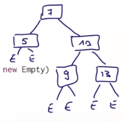
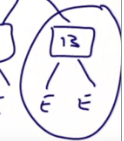
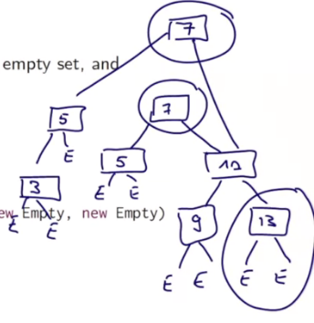
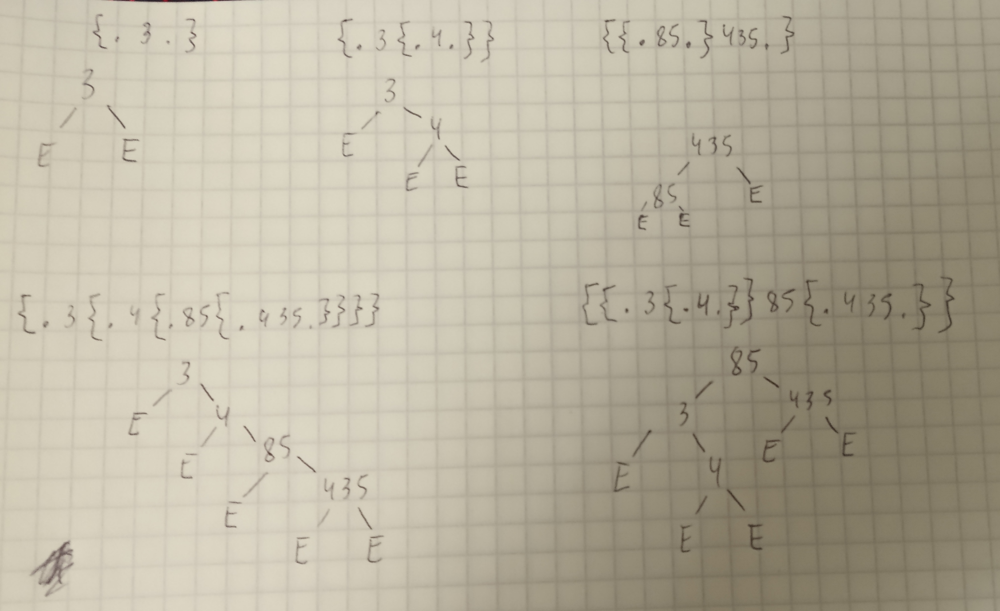
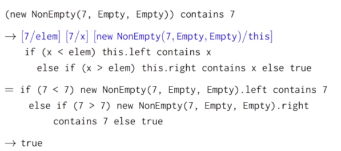

# Иерархия классов

На сессиях мы узнали об объектах. В этот раз мы узнаем иерархию классов и посмотрим, как классы расширяют друг друга. Важный момент, когда мы имеем классы - это модель вычисления. Потому что вызываемый метод может быть заивим от рантайма получателя этого метода, этот концепт называется динамическое связывание. Это один из стандартных концептов. 

В этот раз мы обобщим всё, что знаем о классах. И посмотрим, как классы кооперируются друг с другом. Мы напишем несколько классов, которые имплементят набор интеджеров и методы для работы с ними.


## Абстрактные классы

Для начала придумаем два метода для этого сета: `incl` для добавления и `contains` для проверки наличия в сете нужного номера.

```scala
abstract class IntSet {
  def incl(x: Int): IntSet
  def contains(x: Int): Boolean 
}
```

Видно, что у нас есть определения функций, но нет их тел. Так можно делать, если класс **абстрактный**.

Абстрактные классы могут содержать члены, которые не имеют определений. С другой стороны, мы не можем создавать объекты из таких классов посредством `new`.

Как же тогда ими пользоваться?


## Бинарные деревья

Один из путей - воспользоваться **структурной данных "Бинарное дерево"**. Есть два вида деревьев: дерево для пустого сета и дерево, состоящее из числа и двух под-деревьев. 

Идея здесь в том, что деревья всегда должны быть отсортированы. например, для такого примера:



Мы хотим поддерживать такую инвариантность (неизменное состояние): каждый узел справа имеет значения выше, чем узлы слева. 

Это позволит нам позже проще написать тест `contents`, определяющий, есть ли значение в дереве.


### Пустое дерево

Начнём с пустого дерева.

Такое дерево очень легко создать. Мы будем всегда отвечать `false` на `contains` и `include`, который возвращает новый сет, будет возвращать два пустых сета вместе с переданным значением:

```scala
class Empty extends IntSet {
  def contains(x: Int): Boolean = false
  def incl(x: Int): IntSet = new NonEmpty(x, new Empty, new Empty)
}
```

Судя по структуре, `incl` как бы "создаёт" два нижних блока под только что включённым. На изображении выполнение `incl(13)` создаст вот такую структуру:




### Непустое дерево

```scala
class NonEmpty(elem: Int, left: IntSet, right: IntSet) extends IntSet {
  
  def contains(x: Int): Boolean =
    if (x < elem) left contains x
    else if (x > elem) right contains x
    else true

  def incl(x: Int): IntSet =
    if (x < elem) new NonEmpty(elem, left incl x, right)
    else if (x > elem) new NonEmpty(elem, left, right incl x)
    else this
}
```

Он принимает элемент `elem`, который нужно сохранить в сет и элементы `left` и `right`, которые являются левым и правым поддеревом.

То, что дерево отсортировано, позволяет нам быстро проверять наличие элементов в нём, а именно: сразу делить дерево пополам при каждой итерации.

Метод `incl` проверяет верхний элемент (`elem` текущего дерева), а затем кладёт `x` в правую или левую ветвь в зависимости от `elem`. В каждом поддереве произойдёт своя проверка далее. В итоге будет возвращён новый объект `NonEmpty`, содержащий уже дерево вместе с `x`.


### Неизменяемые структуры данных

Кроме того, мы в этой ситуации остаёмся *функциональны*. Это значит, что процесс не подвержен *мутациям*. При каждом вызове `incl` создаётся новое дерево, в котором остаётся старое. На самом деле, процесс выглядит следующим образом. Например, если мы добавим элемент 3 в дерево, произойдёт следующее:



1. Пытаемся положить цифру 3;
2. Создаём новый узел 3 с двумя пустыми субдеревьями;
3. Этот узел становится субдеревом узла 5 слева, справа остаётся E;
4. 5 становится левым субдеревом 7 вместе с новой 3;
5. Правая сторона дерева остаётся прежней.

Мы теперь как бы имеем два дерева, которые деляет правую сторону, но отличаются в левой стороне. 

Такие структуры данных называются **Persistent** (Неизменяемые структуры данных). Они так называются потому что даже когда мы делаем "изменения", старая структура не исчезает бесследно, а остаётся внутри. Это один из главных принципов для работы с коллекциями в функциональном программировании.


## toString

Теперь, когда методы и классы работают, нужно реализовать метод `toString`, чтобы понять, что вообще происходит внутри.

Для пустого и непустого соответственно:

```scala
override def toString = "."
override def toString = "{" + left + elem + right + "}"
```

Проверим вывод:

```scala
val t1 = new NonEmpty(3, new Empty, new Empty)
println(t1) // {.3.}
val t2 = t1 incl 4
println(t2) // {.3{.4.}}
```

## Терминология
`Empty` и `NonEmpty` расширяют класс `IntSet`. Это значит, что эти типы *conform* (соответствуют?) типу `IntSet`. Мы можем применять объекты этих типов в любых местах, где требуется объект типа `IntSet`.

`IntSet` - суперкласс для своих подклассов.

Все суперклассы (прямые и непрямые) какого-либо класса называются **базовые**. К примеру, базовые классы для `NonEmtpy` - это `IntSet` и `Object` (в Java все классы являются наследниками `Object`, как и в Scala).

Определения подклассов **реализуют** абстрактные функции базового класса `IntSet`. А вот для переопределения (*redefine*) неабстрактного методы нужно использовать специальное слово `override` (**переопределение**).

Кстати, в Java слово `override` опционально, в Scala оно необходимо, чтобы программист меньше ошибался.


## Object definitions

Ещё одна вещь для улучнеия - это статус пустого IntSet класса. Можно заметить, что всегда нужен только один `Empty`, так что возможность создавать их - перебор для программы. 

В Scala этого очень легко достичь. Достаточно использовать определение объекта, а не класса, как раньше:

```scala
object Empty extends IntSet {
  def contains(x: Int): Boolean = false
  def incl(x: Int): IntSet = new NonEmpty(x, Empty, Empty)
  override def toString = "."
}
```

Теперь на него не работает слово `new`, поэтому в создании `NonEmpty` мы и передаём тот же самый `Empty`. Этот сет никогда ничего не содержит, поэтому мы можем ссылаться на него без опасений, что он поменяется.

Таким образом мы определили *singleton object* (объект-одиночка). Он будет создан в момент, когда программа впервые запросит его, и больше не будет вызываться.

В терминах вычислений синглтоны являются *значениями* (values), поэтому при их вызове никогда не происходит вычислений. 


## Программы

До текущего момента мы вызывали весь код Scala из REPL (Worksheet). Но Scala предназначена для разработки standalone приложений. Каждое такое приложение будет содержать минимум объект с методом `main`:

```scala
object Hello {
  def main(args: Array[String]) = println("Hello world")
}
```

Эту программу можно скомпилировать через `scalac` и запустить через `scala`. В этой ситуации и вызов `java` запустит программу успешно. 


## Упражнение

Добавить новый метод в иерархию `IntSet`. Это метод `union`, который должен объединять два сета. Абстрактный класс для него:

```scala
abstract class IntSet {
  def incl(x: Int): IntSet
  def contains(x: Int): Boolean
  def union(other: IntSet): IntSet
}
```

Как мы это сделаем?

```scala
// сами сеты
val t1 = new NonEmpty(3, Empty, Empty)
val t2 = t1 incl 4
println(t2) // {.3{.4.}}

val t3 = new NonEmpty(435, Empty, Empty)
val t4 = t3 incl 85
println(t4) //{{.85.}435.}

// объединить t4 и t2
println(t4 union t2) //


// для Empty
def union(other: IntSet): IntSet = other

def union(other: IntSet): IntSet = {
    // incl нужно вызывать в конце, иначе - бесконечная рекурсия
    // other.incl(elem).union(left).union(right)
    //other.union(left).union(right).incl(elem) // {{.3{.4.}}85{.435.}}
    ((left union right) union other) incl elem // {.3{.4{.85{.435.}}}}
}

```

Преподаватель складывает ветки, а потом прибавляет other. Я же прибавляю к other сначала левую ветку, потом правую. В конце добавляется элемент, который находится в текущем сете. Благодаря тому, что `union` пустого сета не делает никакие вызовы - рекурсия завершается.

По большому счёту, мы оба строим верные деревья:



Отличаются лишь стартовые точки построения (если бы я прибавлял сет, меньший исходного, то по логике преподавателя он бы весь ушёл влево. Поэтому там и E, ведь я добавил большие элементы).


## Динамическое связывание

В таких случаях как выше ООП языки используют *dynamic method dispatch*. Это процесс выбора, какую имплементацию методы или функции вызвать в рантайме. 




## Выводы

Можно заметить, что динамический выбор методов в ООП-языках похож на работу high-order функций в функциональных языках. В обоих случаях код, который требуется вызвать, не указан статично (например, мы не указываем явно `Empty.union`). Он определяется значением, которое пришло в рантайме.

Можем ли мы имплементировать концепты друг через друга?

- Можем ли мы создавать объекты в функциональных языках?
- Можем ли мы создавать функции высшего порядка, используя объекты?

Этот вопрос имеет много ответов и в лекции его оставляют для подумать.