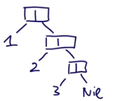
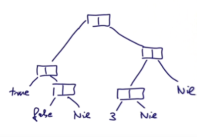

# Полиморфизм

Первые три недели мы фокусировались на функциях, классах, структурах данных и том, как они вычисляются. Теперь мы сконцентрируемся на типах. Это то, как компилятор смотрит на наши данные, функции и классы. Мы узнаем о фундаментальных путях абстрагировать и композировать типы. Главный концепт тут параметризация типов. 

**Параметризация типов** значит, что классы и методы могут иметь типы в качестве параметров. 


## Неизменяемый связанный список

В прошлый раз мы посмотрели много видов данных - от простого `Int` до сложного `IntSet`.

Взглянем на структуру, которая фундаментальна для множества функциональных языков: **Cons-List**. Это **неизменяемый связанный список** (*immutable linked list*).


Он состоит из двух строительных блоков:

- Nil (пустой лист);
- Cons (ячейка, содержащая элемент и остаток листа).

Например:

Лист `List(1, 2, 3)` будет работать так: Первая ячейка содержит `1` и остаток листа. Вторая ячейка - `2` и остаток листа...



Пример посложнее:

`List(List(true, false), List(3))`:




Пример того, как реализовать это в Scala:

```scala
trait IntList ...
class Cons(val head: Int, val trait: IntList) extends IntList ...
class Nil extends IntList ...
```

Лист будет:

- Либо пустым листом `new Nil`;
- Либо листом `new Cons(x, xs)` состоящий из элемента `x` и хвоста `xs`.

Новый элемент, которого раньше не было:

`val head, val trait`

Это одновременно и параметры класса, и его поля. 

Эквивалент:

```scala
class Cons(_head: Int, _tail: IntList) extends IntList {
  val head = _head
  val tail = _tail
}
```


## Параметризация типов

Реализация листа только для `Int` (через передачу `IntList`) - это слишком узкая специализация для класса. Если мы захотим сделать лист `Double` - нам придётся создавать новую иерархию классов.

Мы можем обобщить определения, используя параметризацию типов:

```scala
trait List[T]
class Cons[T](val head: T, val tail: List[T]) extends List[T]
class Nil[T] extends List[T]
```


## Исходные коды

Связный лист:

```scala
package scala.main

import java.util.NoSuchElementException

trait List[T] {
  def isEmpty: Boolean
  def head: T
  def tail: List[T]
}

class Cons[T](val head: T, val tail: List[T]) extends List[T] {
  // val head: T и val tail: List[T] определяют абстрактные определения из трейта
  // по сути поэтому можно не писать вручную
  def isEmpty: Boolean = false
}

class Nil[T] extends List[T] {
  override def isEmpty: Boolean = true
  // Nothing работает, ведь это подтип всех типов, поэтому абстрактный метод всё равно переопределён
  // (Nothing - подтип T, поэтому так можно)
  override def head: Nothing = throw new NoSuchElementException("Nil.head")
  override def tail: Nothing = throw new NoSuchElementException("Nil.tail")
}


```


## Обобщённые функции

Функции тоже могут быть генериками.

```scala
def singleton[T](elem: T) = new Cons[T](elem, new Nil[T])
```

Затем можно написать:

```scala
singleton[Int](1)
singleton[Boolean](true)
```

На самом деле, компилятор Scala обычно может извлекать параметры прямо из переданного типа:

```scala
singleton(1)
singleton(true)
```


## Стирание типов

Внутри класса не хранится никакой информации о его типе-параметре. Типы важны только для компилятора. 

Параметры типов не влияют на вычисления в Scala. Мы можем представить, что все типизированные параметры и аргументы удаляются из программы.

Это называется **стирание типов** (*type erasure*).

Некоторые языки хранят типы в рантайме (C++, C#, F#).


## Полиморфизм

Полиморфизм значит, что функция может быть нескольких типов. Для программирования это означает:

- Функция может быть применена к аргументам многих типов;
- Тип может иметь экземпляры многих типов.

Два принципа полиморфизма:

- subtyping: экземпляры подкласса могут быть переданы туда, где требуется базовый класс;
- generics: экземпляры функций или классов могут быть созданы через параметризацию типов.


## Упражнение

Написать функцию `nth` которая принимает число `n` и лист и выбирает n-ый элемент листа. Элементы начинаются с нуля.

Если индекс снаружи [0, длина листа) - кидать `IndexOutOfBoundsException`.

Ответ:

```scala
package scala.main

import java.util.NoSuchElementException

import scala.annotation.tailrec

object Main extends App {
  val list = new Cons[Int](3424, new Cons[Int](123, new Cons[Int](324324, new Nil[Int])))
  println(list.nth(0))
  println(list.nth(1))
  println(list.nth(2))
  println(list.nth(3)) // exception
}


trait List[T] {
  def isEmpty: Boolean
  def head: T
  def tail: List[T]
  def nth(n: Int): T
}

class Cons[T](val head: T, val tail: List[T]) extends List[T] {
  // val head: T и val tail: List[T] определяют абстрактные определения из трейта
  // по сути поэтому можно не писать вручную
  def isEmpty: Boolean = false

  def nth(n: Int): T = {
    @tailrec
    def iter(n: Int, acc: Int, l: List[T]): T = {
      if (n == acc) l.head
      // если элемент последний, то нельзя бросать исключение, пока не удостоверились, что это не нужный элемент
      else if (l.tail.isEmpty) throw new IndexOutOfBoundsException
      else iter(n, acc+1, l.tail)
    }
    iter(n, 0, this)
  }

}

class Nil[T] extends List[T] {
  def isEmpty: Boolean = true
  // Nothing работает, ведь это подтип всех типов, поэтому абстрактный метод всё равно переопределён
  // (Nothing - подтип T, поэтому так можно)
  def head: Nothing = throw new NoSuchElementException("Nil.head")
  def tail: Nothing = throw new NoSuchElementException("Nil.tail")
  def nth(n: Int): Nothing = throw new IndexOutOfBoundsException("Nil.nth")
}
```

