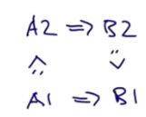

# Вариантность

Вариантность - это отношения полиморфизма подтипов и обобщений. Материалы могут оказаться сложными, и они не очень важны, если нужно просто освоить язык. Они больше позволяют заглянуть в то, как язык работает "под капотом".

Как мы знаем, некоторые типы могут быть ковариантными, а некоторые - не могут. В чём же разница между такими типами? Например, List, который ковариантен, является неизменяемым, когда как Array - изменяем потому что мы можем добавить в него элементы. 

## Определение вариантности

Напоминание:

- `S <: T` значит, что *S это подтип T* (ковариантность);
- `S >: T` значит, что *S это супертип T или T это подтип S* (контрвариантность).

На самом деле, есть три вида вариантности, а не только два.

Пусть `C[T]` - параметризованный тип, а `A` и `B` - такие типы, что `A <: B` (A - подтип B). В общем случае будет существовать *три* возможных отношения между `C[A]` и `C[B]`:

- `C[A] <: C[B]`, где `C` - ковариантен;
- `C[A] >: C[B]`, где `C` - контрвариантен;
- `C[A]` и `C[B]` не являются подтипами друг друга, где `C` - невариантен.

Скала позволяет определить вариантность через аннотацию параметра типа:

- `class C[+A]`, где `C` - ковариантен;
- `class C[-A]`, где `C` - контрвариантен;
- `class C[A]`, где `C` - невариантен;


## Упражнение

Предположим, есть два функциональных типа:

```
type A = IntSet => NonEmpty
type B = NonEmpty => IntSet
```

Как они взаимосвязаны?

Вспомним принцип Барбары Лисков:

- Если `A <: B` - тогда всё, что можно сделать со *значением* типа `B` должно быть возможно сделать со *значением* типа `A`. Так работают интерфейсы и наследование в целом. Все дети интерфейса B будут иметь некоторые одинаковые методы. 

Значение типа `A` - NonEmpty, а типа `B` - IntSet. `A` по определению является подтипом `B`, поэтому ответ, очевидно, `A <: B`.

Рассуждение преподавателя:

*Что можно сделать с сетом B? Передать в него NonEmpty и получить IntSet. Можно ли сделать то же самое с типом A? Да, можно. В A можно передать NonEmpty и получить NonEmpty сет обратно. А этот самый NonEmpty - это подтип IntSet, который возвращает B. Поэтому можно сказать, что A удовлетворяет тому же **контракту**, что и тип B. Но A может принять больше видов сетов, чем B, поэтому это подтип.*


## Обобщение правила



Если у нас есть два функциональных типа, `A1 => B1` и `A2 => B2` и первый тип является подтипом второго (отношение `<:`), тогда:

- Их результаты направлены в том же отношении: `B1 <: B2`;
- Их аргументы направлены в обратном отношении: `A2 <: A1`.

Из этого следует, что **функции** *контрвариантны по аргмуентам* и *ковариантны по результатам*.


# Правила проверки вариантности Scala

В Scala нельзя просто сделать всё подряд ковариантным - иначе мы столкнёмся с той же проблемой, что испытывает Java в своих массивах. 

Например:

```scala
class Array[+T] {
  def update(x: T)
}
```

Проблемная комбинация:

- Ковариантный параметр T...
- ...который стоит в позиции параметра в методе `update`.

Компилятор Scala не допустит такие комбинации. Грубо говоря, запрещены комбинации:

- Ковариантные параметры могут являться только результатами методов;
- Контрвариантные параметры могут быть только аргументами методов;
- Инвариантные параметры можно использовать везде.


## Применение

В третьей неделе было [упражнение List](../../Week%203/Projects/List/src/scala/main/List.scala) c классом `Nil`:

```scala
trait List[T] { ...

class Cons[T](val head: T, val tail: List[T]) extends List[T] { ...

class Nil[T] extends List[T] { ...
```

Проблема здесь в том, что у нас был лишь один пустой лист, но мы *не могли сделать его объектом* (у объекта не может быть параметра). Мы можем сделать это таким образом:

```scala
trait List[+T] 
object Nil extends List[Nothing]
```

Ведь Nothing - это подтип всех типов, а List ковариантен, ведь мы дописали ему плюс. Поэтому T+ может быть подтипом чего-либо. 


## Упражнение

Почему не работает следующий дополнительный метод (ошибка проверки типов)?

```scala
trait List[+T] {
  def prepend(elem: T): List[T] = new Cons(elem, this)
}
```

- prepend привращает List в изменяемый класс;
- prepend проваливает проверку вариантности;
- prepend правая сторона содержит ошибку типа.

Тип T здесь ковариантен и используется как аргумент метода. Это запрещено по правилам вариантности. 

Почему?

Такое преобразование *нарушает принцип Барбары Лисков*. Например, пользователь может сделать следующее, когда `xs` имеет тип `List[IntSet]` : `xs.prepend(Empty)`. 

Но то же действие с типом `List[NonEmpty]` вызовет ошибку (NonEmpty - это конкретный тип и не может содержать Empty). Поэтому `List[NonEmpty]` не является подтипом `List[IntSet]`. Поэтому передавать ковариантный параметр нельзя.

По сути проблема та же, что в Java.


## Нижняя граница

По идее, метод prepend имеет смысл для неизменяемых листов. Как же сделать его вариантно-верным? Можно использовать *нижнюю границу*. Тогда параметром метода будет `U`, который должен быть супертипом `T`. Этот параметр можно передать в метод. 

```scala
trait List[+T] {
  def prepend [U >: T](elem: U): List[U] = new Cons(elem. this)
}
```

Это проходит проверку вариантности, ведь:

- Ковариантные параметры можно использовать как *нижние границы* для аргументов методов;
- Контрвариантные параметры могут быть использоавны как *верхние границы* для аргументов методов.


## Упражнение

Есть метод:

```scala
trait List[+T] {
  def prepend [U >: T](elem: U): List[U] = new Cons(elem. this)
}
```

Какой результат вернёт:

```scala
def f(xs: List[NonEmpty], x: Empty) = xs prepend x
```

Варианты:

- `List[NonEmpty]`;
- `List[Empty]`;
- `List[IntSet]`;
- `List[Any]`.

Правильный ответ - `List[IntSet]`, ведь это супертип для передаваемого листа `NonEmpty` и аргумента `Empty`.

Компилятор ищет ближайший общий супертип в такой ситуации.