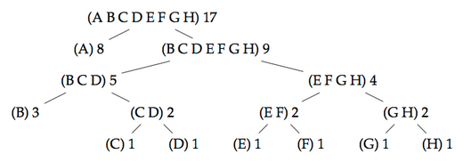

# Разбор практикии

**Assignment 4: Huffman coding**

Практика заключалась в использовании сопоставления с образцом на примере Алгоритма Хаффмана.

*Алгоритм Хаффмана - жадный алгоритм оптимального префиксного кодирования алфавита с минимальной избыточностью.*



Деревья состоят из листьев (Leaf) и ветвей (Fork):

```scala
abstract class CodeTree
case class Fork(left: CodeTree, right: CodeTree, chars: List[Char], weight: Int) extends CodeTree
case class Leaf(char: Char, weight: Int) extends CodeTree
```


## Часть 1: Основы

Сначала нужно было посчитать вес и количество символов для деревьев.

```scala
def weight(tree: CodeTree): Int = tree match {
  case Leaf(c, w) => w
  case Fork(l, r, c, w) => weight(l) + weight(r)  // Вилка есть сумма листьев, поэтому вес самой вилки не прибавляем
}

def chars(tree: CodeTree): List[Char] = tree match {
  case Leaf(c,w) => List(c)
  case Fork(l,r,c,w) => chars(l) ::: chars(r)
}
```

Затем метод, совмещающий два дерева. Это делается посредством создания новой ветви, суммирующей массивы символов (считаем, что в двух деревьях они не повторяются) и веса:

```scala
def makeCodeTree(left: CodeTree, right: CodeTree) =
  Fork(left, right, chars(left) ::: chars(right), weight(left) + weight(right))
```


## Часть 2: Генерация деревьев по Хаффману

Здесь нужно было посчитать количество каждого символа в массиве и вернуть лист кортежей (Символ, Количество):

```scala
def times(chars: List[Char]): List[(Char, Int)] = {
  @tailrec
  def iter(chars: List[Char], acc: List[(Char, Int)]): List[(Char, Int)] = chars match {
    case x :: Nil => incrementTimes(x, acc)
    case x :: xs => iter(xs, incrementTimes(x, acc))
  }
  iter(chars, List())
}

def incrementTimes(C: Char, list: List[(Char, Int)]): List[(Char, Int)] = increaseTimes(C, 1, list)

// функция проходит по списку посчитанных длин и прибавляет times к нужному char
def increaseTimes(C: Char, t: Int, list: List[(Char, Int)]): List[(Char, Int)] = list match {
  case List() => List((C, t)) // добавление первого элемента нового листа
  case (C, n) :: xs => (C, n+t) :: xs  // нашли записанное количество данного символа, создаём новый лист и возвращаем
  case (x, n) :: Nil => (x,n) :: List((C,t))  // если дошли до конца листа и не нашли символ - просто добавляем новый кортеж
  case (x, n) :: xs => (x,n) :: increaseTimes(C, t, xs)  // если не нашли символ и лист не кончился - идём дальше
}
```

Для этого мне пришлось написать вспомогательную функцию `increaseTimes`. Я думаю, дальше в курсе расскажут, какие коллекции есть. Если бы я знал о Словарях, я бы легко воспользовался ими вместо своих функций.

Затем нужно было реализовать две возможности:

- Из массива с длинами символов создавать Leaf-ы, а затем собирать их в отсортированный по возрастанию количества появлений список;
- Из двух Leaf-ов создать Fork, добавить его в тот же список в правильное место по количеству появлений.

Для этого мне пришлось создать две функции сортировки - для листов (чтобы не нарушать сигнатуру) и обобщённый:

```scala
def sortLeafs(leafs: List[Leaf]): List[Leaf] = {
  val n = leafs.length/2
  if (n == 0) leafs
  else {
    def merge(xs: List[Leaf], ys: List[Leaf]): List[Leaf]  = (xs, ys) match {
      case (List(), ys) => ys
      case (xs, List()) => xs
      case (x :: xs1, y :: ys1) =>
        if (x.weight < y.weight) x :: merge(xs1, ys)
        else y :: merge(xs, ys1)
    }
    val (fst, snd) = leafs splitAt n
    merge(sortLeafs(fst), sortLeafs(snd))
  }
}

// по возрастанию, но для абстрактного CodeTree
// проблема: CodeTree не имеет weight сама по себе, поэтому нужно раскладывать через PM
def sortCodeTree(list: List[CodeTree]): List[CodeTree] = {
  val n = list.length/2
  if (n == 0) list
  else {
    def merge(xs: List[CodeTree], ys: List[CodeTree]): List[CodeTree] = (xs, ys) match {
      case (List(), ys) => ys
      case (xs, List()) => xs

      // все возможные случаи - по два форка или листа, по одному форку или листу

      case (Leaf(cx, wx) :: xs1, Leaf(cy, wy) :: ys1 ) =>
        if (wx < wy) Leaf(cx, wx) :: merge(xs1, ys)
        else Leaf(cy, wy) :: merge(xs, ys1)

      case (Fork(lx, rx, cx ,wx) :: xs1, Fork(ly, ry, cy ,wy) :: ys1) =>
        if (wx < wy) Fork(lx, rx, cx ,wx):: merge(xs1, ys)
        else Fork(ly, ry, cy ,wy)  :: merge(xs, ys1)

      case (Leaf(cx, wx) :: xs1, Fork(ly, ry, cy ,wy) :: ys1 ) =>
        if (wx < wy) Leaf(cx, wx) :: merge(xs1, ys)
        else Fork(ly, ry, cy ,wy) :: merge(xs, ys1)

      case (Fork(lx, rx, cx ,wx) :: xs1, Leaf(cy, wy) :: ys1 ) =>
        if (wx < wy) Fork(lx, rx, cx ,wx) :: merge(xs1, ys)
        else Leaf(cy, wy) :: merge(xs, ys1)
    }
    val (fst, snd) = list splitAt n
    merge(sortCodeTree(fst), sortCodeTree(snd))
  }
}
```

Метод сортировки листов был использован в методе создания сортированного списка листов и потому был необходим отдельно от обобщённого:

```scala
def makeOrderedLeafList(freqs: List[(Char, Int)]): List[Leaf] = {
  def iter(freqs: List[(Char, Int)], acc: List[Leaf]): List[Leaf] = freqs match {
    case (x, n) :: Nil => List(Leaf(x, n))
    case (x, n) :: xs => iter(xs, acc) ::: List(Leaf(x,n))
  }
  sortLeafs(iter(freqs, List()))
}
```

А вот далее требовалось взять первые два Leaf, совместить их в Fork, удалить из исходного списка, а Fork вставить в правильное место в списке (список сортирован по возрастанию). Здесь я и использовал обобщённый список:

```scala
def combine(trees: List[CodeTree]): List[CodeTree] = trees match {
  case x :: Nil => trees
  case x :: y :: xs => sortCodeTree(Fork(x, y, chars(x) ::: chars(y), weight(x) + weight(y)) :: xs)
}
```

`Combine` не должна итерировать по списку, а работать только с первыми двумя листами и выходить.

А вот дальше нужно было написать итерирование. Оно основывалось на функции singleton:

```scala
def singleton(trees: List[CodeTree]): Boolean = trees match {
  case x :: Nil => true
  case x :: xs => false
}
```

Функция-итератор `until` принимала в себя два функциональных аргумента - `combine` и `singleton` и вызывалась следующим образом: `until(singleton, combine)(trees)`

```scala
def until(done: List[CodeTree] => Boolean, merge: List[CodeTree] => List[CodeTree])(trees: List[CodeTree]): List[CodeTree] =
  if (done(trees)) trees
  else until(done, merge) (merge(trees))
```

Наконец, необходимо было построить кодовое дерево из списка символов, состоящее из ветвей и листьев, отсортированное по возрастанию. По этому дереву должна быть возможность составить оптимальный код Хаффмана:

```scala
def createCodeTree(chars: List[Char]): CodeTree = {
  val freqs = times(chars)
  val leafs = makeOrderedLeafList(freqs)
  until(singleton, combine)(leafs).head
}
```


## Часть 3: Декодирование

В этой части было необходимо раскодировать следующий текст:

```scala
val frenchCode: CodeTree = Fork(Fork(Fork(Leaf('s',121895),Fork(Leaf('d',56269),Fork(Fork(Fork(Leaf('x',5928),Leaf('j',8351),List('x','j'),14279),Leaf('f',16351),List('x','j','f'),30630),Fork(Fork(Fork(Fork(Leaf('z',2093),Fork(Leaf('k',745),Leaf('w',1747),List('k','w'),2492),List('z','k','w'),4585),Leaf('y',4725),List('z','k','w','y'),9310),Leaf('h',11298),List('z','k','w','y','h'),20608),Leaf('q',20889),List('z','k','w','y','h','q'),41497),List('x','j','f','z','k','w','y','h','q'),72127),List('d','x','j','f','z','k','w','y','h','q'),128396),List('s','d','x','j','f','z','k','w','y','h','q'),250291),Fork(Fork(Leaf('o',82762),Leaf('l',83668),List('o','l'),166430),Fork(Fork(Leaf('m',45521),Leaf('p',46335),List('m','p'),91856),Leaf('u',96785),List('m','p','u'),188641),List('o','l','m','p','u'),355071),List('s','d','x','j','f','z','k','w','y','h','q','o','l','m','p','u'),605362),Fork(Fork(Fork(Leaf('r',100500),Fork(Leaf('c',50003),Fork(Leaf('v',24975),Fork(Leaf('g',13288),Leaf('b',13822),List('g','b'),27110),List('v','g','b'),52085),List('c','v','g','b'),102088),List('r','c','v','g','b'),202588),Fork(Leaf('n',108812),Leaf('t',111103),List('n','t'),219915),List('r','c','v','g','b','n','t'),422503),Fork(Leaf('e',225947),Fork(Leaf('i',115465),Leaf('a',117110),List('i','a'),232575),List('e','i','a'),458522),List('r','c','v','g','b','n','t','e','i','a'),881025),List('s','d','x','j','f','z','k','w','y','h','q','o','l','m','p','u','r','c','v','g','b','n','t','e','i','a'),1486387)


val secret: List[Bit] = List(0,0,1,1,1,0,1,0,1,1,1,0,0,1,1,0,1,0,0,1,1,0,1,0,1,1,0,0,1,1,1,1,1,0,1,0,1,1,0,0,0,0,1,0,1,1,1,0,0,1,0,0,1,0,0,0,1,0,0,0,1,0,1)
```

Это частота символов Французского языка, посчитанная из статьи https://fr.wikipedia.org/wiki/Fr%C3%A9quence_d%27apparition_des_lettres_en_fran%C3%A7ais .


Функцию `decode` я написал двумя способами. В первом случае я итерировался по типу элемента дерева (ветвь или лист?):

```scala
def decode(tree: CodeTree, bits: List[Bit]): List[Char] = {

  def iterSecretByBits(itertree: CodeTree, bits: List[Bit]): List[Char] = bits match {
    case Nil => itertree match {  // если биты закончились
      case Fork(_, _, _, _) => throw new Error("There is no more secret but last bits sequence lead to fork")
      case Leaf(c, _) => c :: Nil
    }

    case 0 :: xs => itertree match {
      case Fork(l, _, _, _) => iterSecretByBits(l, xs)
      case Leaf(c, _) => c :: iterSecretByBits(tree,bits)
    }

    case 1 :: xs => itertree match {
      case Fork(_, r, _, _) => iterSecretByBits(r, xs)
      case Leaf(c, _) => c :: iterSecretByBits(tree, bits)
    }
  }

  iterSecretByBits(tree, bits)
  
}

```

а во втором - по встреченному биту (0 или 1?):

```scala
def decode(tree: CodeTree, bits: List[Bit]): List[Char] = {

  def iterSecretByType(itertree: CodeTree, bits: List[Bit]): List[Char] = itertree match {
    case Fork(l, r, _, _) =>
      bits match {
        case 0 :: xs => iterSecretByType(l, xs)
        case 1 :: xs => iterSecretByType(r, xs)
      }
    case Leaf(c, _) =>
      bits match {
        case Nil => c :: Nil  // если биты закончились
        case x :: xs => c :: iterSecretByType(tree, bits)
      }
  }

  iterSecretByType(tree, bits)
}

```

Итерация по битам, как по мне, более очевидный и простой путь.

Декодированным секретом оказалась фраза **Huffman est cool**.


## Часть 4a: Кодирование через дерево Хаффмана

Это примитивное кодирование основано на простом проходе по дереву на каждый встреченный символ:

```scala
def encode(tree: CodeTree)(text: List[Char]): List[Bit] = text match {
  case x :: Nil => tree match {
    case Leaf(_,_) => List()
    case Fork(l, r, c, _) =>
      if (chars(l).contains(x)) 0 :: encode(l)(x :: Nil)
      else if (chars(r).contains(x)) 1 :: encode(r)(x :: Nil)
      else throw new Error("No char " + x + " in this fork: " + c)
  }
  case x :: xs1 => encode(tree)(x :: Nil) ::: encode(tree)(xs1)
}
```

Минус здесь в том, что если в тексте встречается символ `a` три раза - будет выполнено три прохода по дереву. 


## Часть 4b: Кодирование через таблицу кодов

Здесь нужно было сначала посчитать коды для всех символов в дереве Хаффмана, а уже по таблице кодировать текст:

```scala
type CodeTable = List[(Char, List[Bit])]

def convert(tree: CodeTree): CodeTable = {
  def iter(nextChars: List[Char]): CodeTable = nextChars match {
    case x :: Nil => (x, encode(tree)(List(x))) :: Nil
    case x :: xs1 => (x, encode(tree)(List(x))) :: iter(xs1)
  }
  iter(chars(tree))
}

```

Я воспользовался уже готовой функцией Encode, передавая туда каждый раз список из одного символа. 

Вообще говоря, здесь требовалось использовать функцию `def mergeCodeTables(a: CodeTable, b: CodeTable): CodeTable`, но я не придумал, как.

Затем нужно было научиться получать из CodeTable код отдельного символа:

```scala
def codeBits(table: CodeTable)(char: Char): List[Bit] = table match {
  case (c, l) :: Nil => if (c == char) l
  else throw new Error("No such char in code table")

  case (c, l) :: xs => if (c == char) l
  else codeBits(xs)(char)
}
```

И, наконец, воспользоваться полученными методами для кодирования текста:

```scala
def quickEncode(tree: CodeTree)(text: List[Char]): List[Bit] = {
  val codeTable = convert(tree)  // сначала строим таблицу кодов
  def iter(chars: List[Char]):List[Bit] = chars match {
    case x :: Nil => codeBits(codeTable)(x)
    case x :: xs1 => codeBits(codeTable)(x) ::: iter(xs1)
  }
  iter(text)
}
```


# Результат

Оценщик поставил мне 9.13/10.00 со следующими замечаниями:

```
======== LOG OF FAILED TESTS ========

[Test Description] combine of a singleton or nil (5pts)(patmat.HuffmanSuite)
[Observed Error] class scala.MatchError: List() (of class scala.collection.immutable.Nil$)
scala.MatchError: List() (of class scala.collection.immutable.Nil$)
	at patmat.Huffman.combine(Huffman.scala:186)
	at patmat.Huffman.combine$(Huffman.scala:186)
	at patmat.Huffman$.combine(Huffman.scala:384)
	at patmat.HuffmanSuite.combine$u0020of$u0020a$u0020singleton$u0020or$u0020nil$u0020$u00285pts$u0029(HuffmanSuite.scala:100)
	at sun.reflect.NativeMethodAccessorImpl.invoke0(Native Method)
	at sun.reflect.NativeMethodAccessorImpl.invoke(NativeMethodAccessorImpl.java:62)
	at sun.reflect.DelegatingMethodAccessorImpl.invoke(DelegatingMethodAccessorImpl.java:43)
	at java.lang.reflect.Method.invoke(Method.java:498)
	at org.junit.runners.model.FrameworkMethod$1.runReflectiveCall(FrameworkMethod.java:47)
	at org.junit.internal.runners.model.ReflectiveCallable.run(ReflectiveCallable.java:12)
	at org.junit.runners.model.FrameworkMethod.invokeExplosively(FrameworkMethod.java:44)
	at org.junit.internal.runners.statements.InvokeMethod.evaluate(InvokeMethod.java:17)
	at org.junit.internal.runners.statements.FailOnTimeout$StatementThread.run(FailOnTimeout.java:74)

[Test Description] times of nil (10pts)(patmat.HuffmanSuite)
[Observed Error] class scala.MatchError: List() (of class scala.collection.immutable.Nil$)
scala.MatchError: List() (of class scala.collection.immutable.Nil$)
	at patmat.Huffman.iter$1(Huffman.scala:82)
	at patmat.Huffman.times(Huffman.scala:86)
	at patmat.Huffman.times$(Huffman.scala:80)
	at patmat.Huffman$.times(Huffman.scala:384)
	at patmat.HuffmanSuite.times$u0020of$u0020nil$u0020$u002810pts$u0029(HuffmanSuite.scala:63)
	at sun.reflect.NativeMethodAccessorImpl.invoke0(Native Method)
	at sun.reflect.NativeMethodAccessorImpl.invoke(NativeMethodAccessorImpl.java:62)
	at sun.reflect.DelegatingMethodAccessorImpl.invoke(DelegatingMethodAccessorImpl.java:43)
	at java.lang.reflect.Method.invoke(Method.java:498)
	at org.junit.runners.model.FrameworkMethod$1.runReflectiveCall(FrameworkMethod.java:47)
	at org.junit.internal.runners.model.ReflectiveCallable.run(ReflectiveCallable.java:12)
	at org.junit.runners.model.FrameworkMethod.invokeExplosively(FrameworkMethod.java:44)
	at org.junit.internal.runners.statements.InvokeMethod.evaluate(InvokeMethod.java:17)
	at org.junit.internal.runners.statements.FailOnTimeout$StatementThread.run(FailOnTimeout.java:74)

[Test Description] makeOrderedLeafList of nil (5pts)(patmat.HuffmanSuite)
[Observed Error] class scala.MatchError: List() (of class scala.collection.immutable.Nil$)
scala.MatchError: List() (of class scala.collection.immutable.Nil$)
	at patmat.Huffman.iter$2(Huffman.scala:108)
	at patmat.Huffman.makeOrderedLeafList(Huffman.scala:112)
	at patmat.Huffman.makeOrderedLeafList$(Huffman.scala:107)
	at patmat.Huffman$.makeOrderedLeafList(Huffman.scala:384)
	at patmat.HuffmanSuite.makeOrderedLeafList$u0020of$u0020nil$u0020$u00285pts$u0029(HuffmanSuite.scala:69)
	at sun.reflect.NativeMethodAccessorImpl.invoke0(Native Method)
	at sun.reflect.NativeMethodAccessorImpl.invoke(NativeMethodAccessorImpl.java:62)
	at sun.reflect.DelegatingMethodAccessorImpl.invoke(DelegatingMethodAccessorImpl.java:43)
	at java.lang.reflect.Method.invoke(Method.java:498)
	at org.junit.runners.model.FrameworkMethod$1.runReflectiveCall(FrameworkMethod.java:47)
	at org.junit.internal.runners.model.ReflectiveCallable.run(ReflectiveCallable.java:12)
	at org.junit.runners.model.FrameworkMethod.invokeExplosively(FrameworkMethod.java:44)
	at org.junit.internal.runners.statements.InvokeMethod.evaluate(InvokeMethod.java:17)
	at org.junit.internal.runners.statements.FailOnTimeout$StatementThread.run(FailOnTimeout.java:74)

[Test Description] singletons of Nil (3pts)(patmat.HuffmanSuite)
[Observed Error] class scala.MatchError: List() (of class scala.collection.immutable.Nil$)
scala.MatchError: List() (of class scala.collection.immutable.Nil$)
	at patmat.Huffman.singleton(Huffman.scala:169)
	at patmat.Huffman.singleton$(Huffman.scala:169)
	at patmat.Huffman$.singleton(Huffman.scala:384)
	at patmat.HuffmanSuite.singletons$u0020of$u0020Nil$u0020$u00283pts$u0029(HuffmanSuite.scala:77)
	at sun.reflect.NativeMethodAccessorImpl.invoke0(Native Method)
	at sun.reflect.NativeMethodAccessorImpl.invoke(NativeMethodAccessorImpl.java:62)
	at sun.reflect.DelegatingMethodAccessorImpl.invoke(DelegatingMethodAccessorImpl.java:43)
	at java.lang.reflect.Method.invoke(Method.java:498)
	at org.junit.runners.model.FrameworkMethod$1.runReflectiveCall(FrameworkMethod.java:47)
	at org.junit.internal.runners.model.ReflectiveCallable.run(ReflectiveCallable.java:12)
	at org.junit.runners.model.FrameworkMethod.invokeExplosively(FrameworkMethod.java:44)
	at org.junit.internal.runners.statements.InvokeMethod.evaluate(InvokeMethod.java:17)
	at org.junit.internal.runners.statements.FailOnTimeout$StatementThread.run(FailOnTimeout.java:74)

```

По сути - я везде забыл выполнить проверку на Nil. Такие тесты или указания отсутствовали в самом задании, а исправить их - дело пяти минут. 