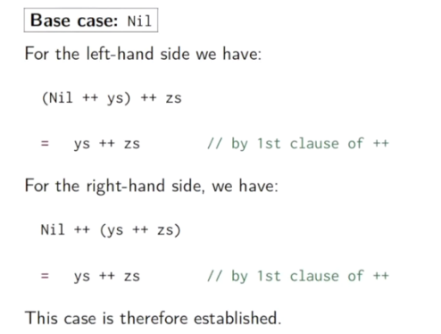
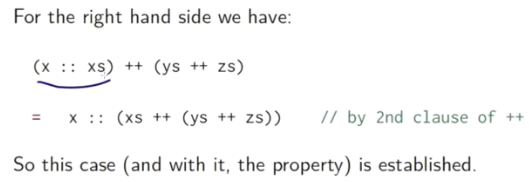
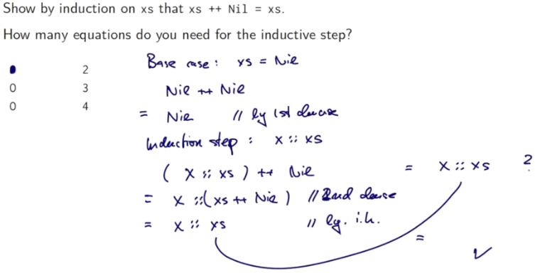

# Техники доказательства

Что означает, что функциональная программа написана правильно. Один из ответов - это "определения в программе удовлетворяют определённым законам". Иногда они представлены в виде эквивалентности между вещами. В этой лекции (и следующей) мы посмотрим на техники доказательства, показывающие, что определённый набор операций удовлетворяет определённым законам.

Вспомним конкатенацию листов (++).

Мы хотим верифицировать, что конкатенация ассоциативна и что пустой лист Nil нейтрален слева и справа:

```scala
(xs ++ ys) ++ zs = xs ++ (ys ++ zs)
xs ++ Nil = xs
Nil ++ xs = xs
```

Как мы можем доказать такие суждения?

Мы докажем их путём **Структурной индукции** (*structural induction*) на листах.

*Структурная индукция — конструктивный метод математического доказательства, обобщающий математическую индукцию (применяемую над натуральным рядом) на произвольные рекурсивно определённые частично упорядоченные совокупности.*

*Структурная рекурсия — реализация структурной индукции в форме определения, процедуры доказательства или программы, обеспечивающая индукционный переход над частично упорядоченной совокупностью.*

*Математическая индукция — метод математического доказательства, который используется, чтобы доказать истинность некоторого утверждения для всех натуральных чисел. Для этого сначала проверяется истинность утверждения с номером 1 — база (базис) индукции, а затем доказывается, что если верно утверждение с номером n, то верно и следующее утверждение с номером n + 1 — шаг индукции, или индукционный переход.*


## Reminder: Natural Induction

Для начала вспомним принципы доказательства на основе натуральной индукции:

Чтобы показать свойство P(n) для всех целых чисел n >= b:

- Показать что у нас есть P(b) (*base case*, свойство работает для наименьшего элемента b);
- Для всех целочисленных n >= b показать *induction step*:
  - если есть P(n), то есть и P(n+1)

### Пример

```scala
def factorial(n: Int): Int =
  if (n == 0) 1  // 1st clause
  else n * factorial(n-1)  // 2nd clause
```

Показать, что для всех `n >= 4` `factorial(n) >= power(2, n)`.

**Base case:**

`factorial(4) = 24 >= 16 = power(2,4)`

**Induction step:** `n+1`

Для `n >= 4`: `factorial(n+1)`:

```
factorial(n + 1) 

>= (n + 1) * factorial(n)  // из самой функции факториала

> 2 * factorial(n)  // мы знаем, что n>4, поэтому это верно

>= 2 * power(2, n)  // из самой гипотезы, которая была выдвинута

= power(2, n+1)  // из свойств степени
```

Доказательство может свободно приравнивать шаги редукции к некоторым условиям. Это работает т.к. мы считаем, что функциональное программирование не имеет побочных эффектов, поэтому условие эквивалентно условию, в которое оно редуцируется.

Этот принцип называется *ссылочной прозрачностью*.


## Structural Induction

Структурная индукция аналогична натуральной:

Чтобы доказать свойство `P(xs)` для всех листов `xs`:

- Показать, что `P(Nil)` существует (*base case*);
- Для листа `xs` и некоторого элемента `x` показать *induction step*:
  - если `P(xs)` существует, то и `P(x :: xs)` существует.


### Пример

Вернёмся к concat. Покажем, что ассоциативность конкатенации листов xs, ys, zs:

`(xs ++ ys) ++ zs = xs ++ (ys ++ zs)`

Используем структурную индукцию на xs. Из имплементации concat,

```scala
def concat[T](xs: List[T], ys: List[T]) = xs match {
  case List() => ys
  case x :: xs1 => x :: concat(xs1, ys)
}
```

Определим два условия (*clause*) ++:

- Nil ++ ys = ys
- (xs :: xs1) ++ ys = x :: (xs1 ++ ys)

Эти условия исходят прямо из определения concat.

### Base case



### Induction step

С левой стороны:


С правой стороны:



Результаты слева и справа совпали. Поэтому свойство доказано.


## Упражнение

