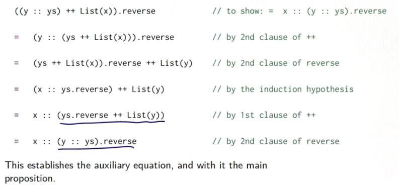

Для более сложного примра возьмём функцию reverse.

Мы возьмём её неэффективное определение, которое более легко ложится под доказательство:

```
Nil.reverse = Nil // 1st clause
(x :: xs).reverse = xs.reverse ++ List(x) // 2nd clause
```

Мы хотим доказать:

```
xs.reverse.reverse = xs
```

## Base case:

Nil.reverse.reverse
= Nil.reverse // by 1st clause of reverse
= Nil reverse // by 1st clause of reverse


## Induction Step:

Для левой стороны:

(x :: xs).reverse.reverse
= (xs.reverse ++ List(x)).reverse  // by 2nd clause of reverse

Для правой стороны:

x :: xs
= x :: xs.reverse.reverse  // по гипотизе

Обе стороны упростились в разные выражения. Но нам нужно, чтобы они были равны:

(xs.reverse ++ List(x)).reverse = x :: xs.reverse.reverse


## Обобщение

Напрямую индукция не работает. Но мы можем **обобщить** выражение. Для *любого* листа ys:

(ys ++ List(x)).reverse = x :: ys.reverse

Это выражение может быть доказано, если провести индукцию уже по ys.


## Base Case

ys = Nil

(Nil ++ List(x)).reverse  // to show:   x :: Nil.reverse

= List(x).reverse   // by 1st clause of ++

= (x :: Nil).reverse   // по определению Листа

= Nil.reverse ++ List(x)  

= Nil ++ (x :: Nil)    // by 2nd clause of reverse

= x :: Nil   // by 1st clause of ++

= x :: Nil.reverse   // by 1st clause of reverse

Правая сторона закончена.


## Inductive Step



