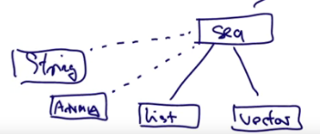
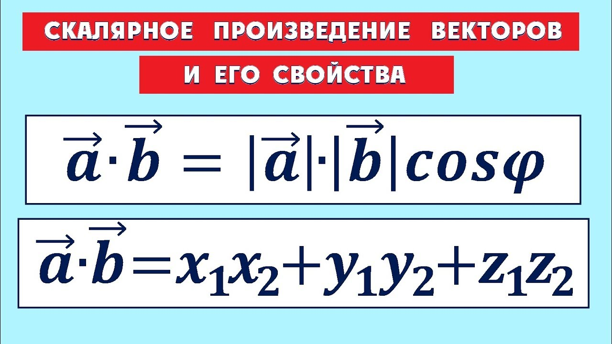

# Другие коллекции

До этого мы посмотрели только List из коллекций. Теперь мы посмотрим на другие коллекции. Они отличаются функциональностью и производительностью в своих нишах, однако, остаются неизменяемыми.

Мы знаем, что листы *линейны*. Это значит, что доступ к первому элементу намного быстрее, чем к центральному или к конечному. Scala предоставляет тип `Vector`, который имеет более сбалансированные паттерны доступа, чем List.


## Vector

Vector состоит из очень мелких деревьев.

Вектор до 32 элементов - это просто массив:


Если он разрастается за 32 ячейки - его структура меняется. Он становится массивом 32 указателей на массивы 32 элементов:


Если и этот размер израсходован - структура меняется снова. Теперь это будут указатели на указатели на массивы 32 элементов. И так далее вплоть до 2^30 степени:


Сколько времени займёт получение какого-нибудь индекса в таком векторе? Довольно немного. Получение элемента <32 - это один запрос доступа (просто вызов по индексу). Получение элемента до 2^10 (1024) - это два запроса. Таким образом, количество запросов равно глубине вектора. Эта глубина растёт очень медленно (6 уровень даёт миллиард элементов). Таким образом, скорость будет примерно такой:


Вектора хороши для операций по объему коллекции (проходящих через коллекцию, *объемные операции*, bulk operations). К примеру, такой *объёмной* операцией является `map`, применяющая функцию для всех элементов коллекции или fold, который схлапывает элементы по оператору.

Это связано с тем, что размеры массивов (32) близки к размеру строки кеша в современных процессорах. Поэтому все 32 элемента обычно попадают в одну строчку кеша и доступ к ним становится очень быстрым.

Листы, с другой стороны, устроены в рекурсивной структуре, где каждый элемент содержит две ячейки, в одной из которых указатель. Указатель может вести куда угодно, поэтому элементы листа могут оказываться в разных строках кеша и страницах памяти.

Зачем тогда вообще нужны Листы, когда есть Вектора? Зависит от программы. Листы быстро получают элементы head и tail. Для векторов такие вызовы наоборот займут лишнее время. Вообще говоря, до текущего момента именно структура List превосходно ложилась на то, как были устроены программы - проверяли один элемент и рекурсивно передавали хвост листа. Если же в программе в основном используются объемные операции вроде `map`, `fold` или `filter` - то лучше использовать `Vector`.

### Переход с List на Vector

Вектора создаются аналогично листам:

```scala
val nums = Vector(1,2,3,4,5,-88)
val people = Vector("Bob", "Bob", "James", "Bob")
```

В векторах можно использовать все те же методы - map, fold, head, tail и т.д.

Однако, исключение составляет операция cons `::` . Это примитивная листовая операция, позволяющая просто построить лист или использовать PM. В векторах используется другая операция:

- `x +: xs` Создаёт новый вектор с лидирующим элементом x и последующими xs (прибавка слева);
- `xs :+ x` Создаёт новый вектор, добавляя элемент x (прибавка справа).

Обратите внимание, что `:` всегда со стороны коллекции.

Как долго длится такая операция? Мы считаем, что вектор неизменяем, поэтому мы создаём новую структуру данных. Но не полностью. Мы берём последний массив и заменяем его на новый, который уже содержит прибавляемый элемент. Конечно, если вектор полностью забит - придётся создать новый уровень. Но пока будем считать, что мы поменяли один массив. Как теперь добавить его в коллекцию? Мы не можем менять указатель из предыдущего массива (из оригинальной коллекции). Поэтому нужный массив опять же копируется с заменой одной ячейки со ссылкой. 


Получается, остальная структура данных осталась прежней. Сложность (теперь уже сложность создания объекта) опять равна вложенности - мы создаём по массиву на каждый уровень вложенности. Это, конечно, медленнее замены *in place*, но мы получаем и профит: две копии коллекции, обе полностью рабочие и не исключают одна-другую. 


## Иерархия коллекций

Vector и List - это две имплементации класса Seq (это суперкласс всех последовательностей (*sequences*)).

Общая диаграмма пакета **scala.collection.immutable**:


Как видно, помимо последовательностей (sequence) ещё есть сеты (set) и карты (map). Они все являются подклассами Iterable, который и является началом Scala-коллекций. 


## Arrays and Strings

Массивы и строки поддерживают те же операции, что и Seq и могут быть неявно конвертированы в последовательности когда необходимо. При этом они **не являются** подклассами Seq, т.к. берутся из библиотеки Java.



```scala
val xs: Array[Int] = Array(1,2,3)
xs map (x => 2 * x)

val ys: String = "Hello World!"
ys filter (_.isUpper)
```


## Range

Ещё один простой тип последовательности - range.

Range - это последовательность равномерно расположенных чисел:

- to (включительно);
- until (невключительно);
- by (шаг)

```scala
val r: Range = 1 until 5  // r: Range = Range 1 until 5
val r2: Range = 1 to 5  // r2: Range = Range 1 to 5
val r3: Range = 1 to 5 by 2  // r3: Range = Range 1 to 5 by 2
```

Как видно, Range не является массивом. Он лишь хранит начало, конец и шаг.

```scala
r3(0)  // res3: Int = 1
r3(1)  // res4: Int = 3
r3(2)  // res5: Int = 5
r3(4)  // java.lang.IndexOutOfBoundsException
```


## Другие операции над последовательностями

```scala
r3 exists (_ == 5)  // res6: Boolean = true
r3 forall (_ > 0)  // res7: Boolean = true
r3 zip r  // res8: IndexedSeq[(Int, Int)] = Vector((1,1), (3,2), (5,3))
```

`zip` возвращает пары чисел, расположенных по одному и тому же индексу. В r это 1,2,3, а в r3 - 1, 3, 5. Если в r пять элементов, а в r3 - всего три, то будет возвращено только три пары, без исключений и вне зависимости от порядка.


```scala
(r zip r3).unzip  // res10: (IndexedSeq[Int], IndexedSeq[Int]) = (Vector(1, 2, 3),Vector(1, 3, 5))
```

`unzip` возвращает пару последовательностей, распакованную из zip-аналогичных структур.

```scala
val r1: Range = 1 to 3
r1.sum  // res11: Int = 6
r1.product  // res12: Int = 6
r1.max  // res13: Int = 3
r1.min  // res14: Int = 1
```

`flatMap` берёт коллекцию xs и функцию f, которая маппит каждый элемент xs к коллекции. Затем он конкатенирует результаты коллекций в одну большую.

```scala
s flatMap (c => List('.', c)) // IndexedSeq[Char] = Vector(., H, ., e, ., l, ., l, ., o, .,  , ., W, ., o, ., r, ., l, ., d)
```

Получается, каждый чар оригинального сообщения становится коллекцией ('.', c), которые затем складываются. Получается строка ".H.e.l.l.o. .W.o.r.l.d"


## Пример: комбинации

Вывести все комбинации номеров x и y где x из 1..M и y из 1..N:

```scala
val M = 5
val N = 10

(1 until M) flatMap (x => (5 to N) map (y => (x,y)))


Vector((1,5), (1,6), (1,7), (1,8), (1,9), (1,10), (2,5), (2,6), (2,7), (2,8), (2,9), (2,10), (3,5), (3,6), (3,7), (3,8), (3,9), (3,10), (4,5), (4,6), (4,7), (4,8), (4,9), (4,10))
```


## Пример: Скалярное произведение векторов

*Скалярное произведение (иногда называемое внутренним произведением) — операция над двумя векторами, результатом которой является скаляр, то есть число, не зависящее от выбора системы координат.*



```scala
def scalarProduct(xs: Vector[Double], ys: Vector[Double]): Double =
  (xs zip ys).map(xy => xy._1 * xy._2).sum
```

Мы собираем соответсвующие элементы в пары (x1, x2), (y1, y2), перемножаем их элементы функцией map, а затем всё складываем.

Другой способ: *pattern matching function value*.

```scala
def scalarProduct(xs: Vector[Double], ys:Vector[Double]): Double =
  (xs zip ys).map{ case (x,y) => x * y}.sum
```

По сути мы используем сокращение PM, ведь:

```scala
{case p1 => e1 ... case pn => en}

// эквивалентно функции

x => x match {case p1 => e1 ... case pn => en}
```


## Пример: простые числа

*Просто́е число́ — натуральное (целое положительное) число, имеющее ровно два различных натуральных делителя — единицу и самого себя.*

```scala
val n = 5

isPrime(5) // true
isPrime(4) // false


def isPrime(n: Int): Boolean = 
  val del: Range = 2 until n
  !del.exists(i => (n>0) & (n%i)==0)
```

exists возвращает true, если найдено хоть одно число i для n>0, не равное 1 или самому n, на которое n делится нацело (без остатка).