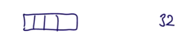
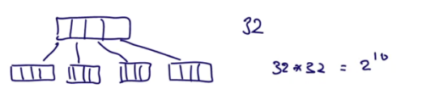
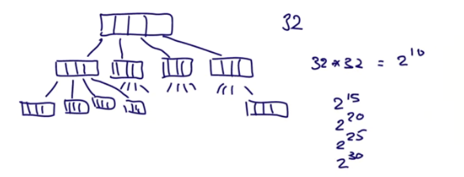
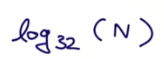
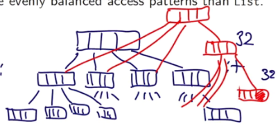
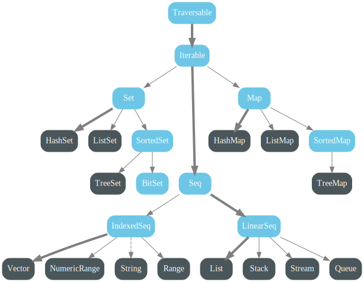

# Другие коллекции

До этого мы посмотрели только List из коллекций. Теперь мы посмотрим на другие коллекции. Они отличаются функциональностью и производительностью в своих нишах, однако, остаются неизменяемыми.

Мы знаем, что листы *линейны*. Это значит, что доступ к первому элементу намного быстрее, чем к центральному или к конечному. Scala предоставляет тип `Vector`, который имеет более сбалансированные паттерны доступа, чем List.


## Vector

Vector состоит из очень мелких деревьев.

Вектор до 32 элементов - это просто массив:



Если он разрастается за 32 ячейки - его структура меняется. Он становится массивом 32 указателей на массивы 32 элементов:



Если и этот размер израсходован - структура меняется снова. Теперь это будут указатели на указатели на массивы 32 элементов. И так далее вплоть до 2^30 степени:



Сколько времени займёт получение какого-нибудь индекса в таком векторе? Довольно немного. Получение элемента <32 - это один запрос доступа (просто вызов по индексу). Получение элемента до 2^10 (1024) - это два запроса. Таким образом, количество запросов равно глубине вектора. Эта глубина растёт очень медленно (6 уровень даёт миллиард элементов). Таким образом, скорость будет примерно такой:



Вектора хороши для операций по объему коллекции (проходящих через коллекцию, *объемные операции*, bulk operations). К примеру, такой *объёмной* операцией является `map`, применяющая функцию для всех элементов коллекции или fold, который схлапывает элементы по оператору.

Это связано с тем, что размеры массивов (32) близки к размеру строки кеша в современных процессорах. Поэтому все 32 элемента обычно попадают в одну строчку кеша и доступ к ним становится очень быстрым.

Листы, с другой стороны, устроены в рекурсивной структуре, где каждый элемент содержит две ячейки, в одной из которых указатель. Указатель может вести куда угодно, поэтому элементы листа могут оказываться в разных строках кеша и страницах памяти.

Зачем тогда вообще нужны Листы, когда есть Вектора? Зависит от программы. Листы быстро получают элементы head и tail. Для векторов такие вызовы наоборот займут лишнее время. Вообще говоря, до текущего момента именно структура List превосходно ложилась на то, как были устроены программы - проверяли один элемент и рекурсивно передавали хвост листа. Если же в программе в основном используются объемные операции вроде `map`, `fold` или `filter` - то лучше использовать `Vector`.

### Переход с List на Vector

Вектора создаются аналогично листам:

```scala
val nums = Vector(1,2,3,4,5,-88)
val people = Vector("Bob", "Bob", "James", "Bob")
```

В векторах можно использовать все те же методы - map, fold, head, tail и т.д.

Однако, исключение составляет операция cons `::` . Это примитивная листовая операция, позволяющая просто построить лист или использовать PM. В векторах используется другая операция:

- `x +: xs` Создаёт новый вектор с лидирующим элементом x и последующими xs (прибавка слева);
- `xs :+ x` Создаёт новый вектор, добавляя элемент x (прибавка справа).

Обратите внимание, что `:` всегда со стороны коллекции.

Как долго длится такая операция? Мы считаем, что вектор неизменяем, поэтому мы создаём новую структуру данных. Но не полностью. Мы берём последний массив и заменяем его на новый, который уже содержит прибавляемый элемент. Конечно, если вектор полностью забит - придётся создать новый уровень. Но пока будем считать, что мы поменяли один массив. Как теперь добавить его в коллекцию? Мы не можем менять указатель из предыдущего массива (из оригинальной коллекции). Поэтому нужный массив опять же копируется с заменой одной ячейки со ссылкой. 



Получается, остальная структура данных осталась прежней. Сложность (теперь уже сложность создания объекта) опять равна вложенности - мы создаём по массиву на каждый уровень вложенности. Это, конечно, медленнее замены *in place*, но мы получаем и профит: две копии коллекции, обе полностью рабочие и не исключают одна-другую. 


## Seq

Vector и List - это две имплементации класса Seq (это суперкласс всех последовательностей (*sequences*)).

Общая диаграмма пакета **scala.collection.immutable**:



