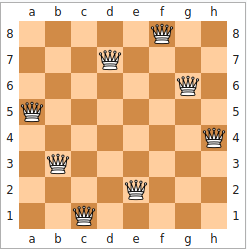
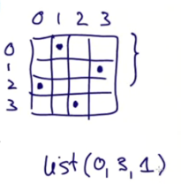
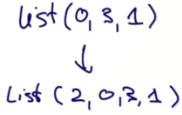
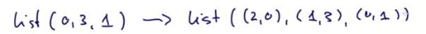

# Сеты и пример комбинаторного поиска

В этой лекции посмотрим на `Set`. Мы скомбинируем сеты и For-выражения в классической проблеме комбинаторного поиска - "Задача о восьми ферзях".

*Широко известная задача по расстановке фигур на шахматной доске. Исходная формулировка: «Расставить на стандартной 64-клеточной шахматной доске 8 ферзей так, чтобы ни один из них не находился под боем другого». Подразумевается, что ферзь бьёт все клетки, расположенные по вертикалям, горизонталям и обеим диагоналям. Обобщение задачи — расставить максимальное количество взаимно не бьющих друг друга ферзей на прямоугольном поле, в частности, квадратном поле, со стороной n.*



Сеты очень близки к последовательностям:

```scala
val fruit = Set("apple", "banana")
val s = (1 to 6).toSet
s map (_ + 2)
fruit filter (_.startsWith == "app")
s.nonEmpty
```

Приницпиальные отличия Set от остальных последовательностей:

- Сеты беспорядочны;
- Сеты не имеют дубликатов внутри;
- Фундаментальная операция для них - это `contains` (у листа это head и tail, а у вектора - index)

Всё перечисленное наглядно:

```scala
val nums = Set(1,2,3,4,5,1)  // nums: scala.collection.immutable.Set[Int] = HashSet(5, 1, 2, 3, 4)
(nums filter (_<3)) map (_/2) contains 0  // res0: Boolean = true
```


## Example: N-Queens

Простая постановка: не должно быть королев (или ферзей в русском языке) в одном и том же ряду, колонке или диагонали.

Один из путей решения (для доски любого размера):

- Поместить по ферзю в каждом ряду;
- Как только поместили k-1 ферзей, k-того ферзя нужно поместить в колонке, которая не попадает ни под одну королеву на доске.

Получается рекурсивный алгоритм:

- Представим, что мы уже сгенерировали все решения помещения k-1 королев на доске размера n;
- Каждое решение презентовано в виде листа (длины k-1), содержащего количество колонок (от 0 до n-1);
- Номер колонки с королевой в k-1 -ом ряду находится в начале листа, затем идёт номер колонки с королевой в ряду k-2 и т.д.;
- Сет решений является сетом листов с одним элементом для каждого решения;
- Теперь, чтобы поместить k-тую королеву, мы генерируем все возможные расширения каждого решения, которое было получено перед новой королевой.

Получается подобный лист:



Лист-решение для первых трёх королев. Последняя королева из трёх находится в колонке 0, затем колонка 3 и колонка 1. Получается, что координаты королев будут (2,0), (1,3), (0,1). 

С новой королевой (четвёртой) должно получиться *новое* решение:




## Задача в Scala

Сигнатура следующая:

```scala
object NQueens {
  // n - количество рядов на шахматной доске
  def queens(n: Int): Set[List[Int]] = ???
}
```

Рекурсивный алгоритм потребует встроенного метода:

```scala
object NQueens {
  // n - количество рядов на шахматной доске
  def queens(n: Int): Set[List[Int]] = {
    def placeQueens(k: Int): Set[List[Int]] = ???
    placeQueens(n)
  }
}
```

Для начала нам нужно предусмотреть возврат из k=0:


```scala
object NQueens {
  // n - количество рядов на шахматной доске
  def queens(n: Int): Set[List[Int]] = {
    def placeQueens(k: Int): Set[List[Int]] =
      if (k == 0) Set(List())
      else
        ???
    placeQueens(n)
  }
}
```

Затем мы используем for-выражение. Чтобы поместить k-тую королеву, нужно сначала поместить k-1 королев:

```scala
object NQueens {
  // n - количество рядов на шахматной доске
  def queens(n: Int): Set[List[Int]] = {
    def placeQueens(k: Int): Set[List[Int]] =
      if (k == 0) Set(List())
      else
        for {
          queens <- placeQueens(k-1)  // первая проблема - поместить k-1 королев
          col <- 0 until n  // вторая проблема - проитерировать через все возможные колонки (доска квадратная, колонки=рядам)
          if isSafe(col, queens)  // проверка безопасности колонки, учитывая всех предыдущих королев
        } yield col :: queens  // прибавили решение спереди
    placeQueens(n)
  }
}
```


## Упражнение: isSafe

Написать реализацию метода `isSafe`:

```scala
@tailrec
def isSafe(col: Int, queens: List[Int]): Boolean = queens match {
  case Nil => true  // просто пустой лист
  case x :: xs if x==col => false  // даже неважно, если xs на деле Nil
  case x :: Nil => true 
  case x :: xs => isSafe(col, xs)
}
```

Преподаватель:

Сначала мы ищем `row`. Это тот ряд, в который мы будем помещать. Логично, что он следует за последним рядом, а, значит, равен длине queens.

Далее он переводит List в координаты:



```scala
def isSafe(col: Int, queens: List[Int]): Boolean = {
  val row = queens.length
  val queensWithRow = (row-1 to 0 by -1) zip queens
  ???
}
```

Теперь мы проверим, есть ли атакуемые королевы для королевы (`row`,`col`), которую мы пытаемся добавить:

```scala
def isSafe(col: Int, queens: List[Int]): Boolean = {
  val row = queens.length
  val queensWithRow = (row-1 to 0 by -1) zip queens
  queensWithRow forall {
    case (r,c) => col != c && math.abs(col -c) != row-r  // после && следует проверка диагонали
  }
}
```

На выходе я получаю два решения:

```scala
HashSet(List(2, 0, 3, 1), List(1, 3, 0, 2))
```

Как видно, мной не были проверены диагонали, только колонки (а ряды проверять не надо, т.к. в каждом по одной королеве по смыслу алгоритма). Поэтому в моём варианте очень много решений, которые неверны. Наконец, преподаватель добавляет метод `show`:

```scala

queens(4) map show

def show(queens: List[Int]) = {
  val lines =
    for (col <- queens.reverse)
    yield Vector.fill(queens.length)("* ").updated(col, "X ").mkString
      "\n" + (lines mkString "\n")
}

```

На выходе получаю следующее (два решения):

```scala
HashSet(
* * X * 
X * * * 
* * * X 
* X * * , 
* X * * 
* * * X 
X * * * 
* * X * )
```


Посмотрим на метод `show`:

```scala
def show(queens: List[Int]) = {
  val lines =
    for (col <- queens.reverse)
    yield Vector.fill(queens.length)("* ").updated(col, "X ").mkString
      "\n" + (lines mkString "\n")
}
```

Тут создаётся список линий `lines`, затем для каждой колонки (из реверснутого решения, т.к. оно в обратную сторону) была создана строчка из звёздочек:

`Vector.fill(queens.length)("* ")`

Затем на позиции col символ был заменён:

`Vector.fill(queens.length)("* ").updated(col, "X ")`

Затем вектор строк был конвертирован в строку: `mkString`.

Ещё можно выводить следующим образом:

```scala
val show3 = queens(8) take 2 map show mkString("\n")
println(show3)

* * * * * X * * 
* * X * * * * * 
* * * * * * X * 
* X * * * * * * 
* * * X * * * * 
* * * * * * * X 
X * * * * * * * 
* * * * X * * * 

* * * * * X * * 
* * * X * * * * 
* X * * * * * * 
* * * * * * * X 
* * * * X * * * 
* * * * * * X * 
X * * * * * * * 
* * X * * * * * 
```

Так мы берём только первые два решения.


`show` возвращает строки через yield, поэтому мы можем вставлять "\n" на лету - println выводит по одной строке за каждый yield как если бы он был в цикле.


# Приложение: пример того, что выводит ошибочный isSafe:

```scala
HashSet(List(1, 3, 2, 0), List(1, 2, 3, 0), List(0, 1, 2, 3), List(3, 0, 2, 1), List(0, 3, 1, 2), List(2, 0, 3, 1), List(2, 1, 0, 3), List(2, 1, 3, 0), List(1, 0, 2, 3), List(0, 3, 2, 1), List(3, 2, 1, 0), List(0, 2, 3, 1), List(2, 3, 1, 0), List(0, 2, 1, 3), List(3, 1, 0, 2), List(1, 0, 3, 2), List(3, 2, 0, 1), List(3, 1, 2, 0), List(2, 3, 0, 1), List(0, 1, 3, 2), List(3, 0, 1, 2), List(1, 2, 0, 3), List(2, 0, 1, 3), List(1, 3, 0, 2))

* * X * 
* * * X 
X * * * 
* X * * 

* * * X 
X * * * 
* * X * 
* X * * 

* X * * 
* * X * 
* * * X 
X * * * 

* * * X 
* X * * 
X * * * 
* * X * 

* * X * 
* * * X 
* X * * 
X * * * 

* X * * 
* * * X 
* * X * 
X * * * 

* * * X 
* X * * 
* * X * 
X * * * 

* * X * 
X * * * 
* X * * 
* * * X 

X * * * 
* * X * 
* * * X 
* X * * 

* X * * 
* * X * 
X * * * 
* * * X 

* * X * 
X * * * 
* * * X 
* X * * 

X * * * 
* * X * 
* X * * 
* * * X 

* * X * 
* X * * 
X * * * 
* * * X 

* X * * 
X * * * 
* * X * 
* * * X 

* * * X 
* * X * 
X * * * 
* X * * 

X * * * 
* * * X 
* * X * 
* X * * 

* * * X 
X * * * 
* X * * 
* * X * 

* * X * 
* X * * 
* * * X 
X * * * 

X * * * 
* * * X 
* X * * 
* * X * 

* X * * 
* * * X 
X * * * 
* * X * 

X * * * 
* X * * 
* * X * 
* * * X 

X * * * 
* X * * 
* * * X 
* * X * 

* * * X 
* * X * 
* X * * 
X * * * 

* X * * 
X * * * 
* * * X 
* * X *
```