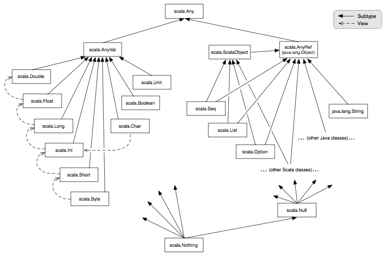

# Как организованы классы

В реальных программах могут быть сотни и тысячи классов. Сейчас мы изучим пакеты и способы добавления одних классов в другие (`import`). Узнаем про стандартную библиотеку Scala и как они расположены в иерархии. 


## Пакеты

В Scala классы расположены в пакетах. Чтобы расположить класс в пакет, нужно написать в файле исходного кода:

```scala
package progfun.examples

object Hello {}
```

После этого можно обратиться к объекту посредством вызова полного имени (*fully qualified name*) - `progfun.examples.Hello`. 


## Импорт

С другой стороны, можно сделать импорт класса, чтобы не указывать полного имени:

```scala
import progfun.examples.Hello

object Test extends App {
  Hello.hello()
}
```

Можно импортировать весь пакет: `import progfun._` (*wildcard import*)

Наконец, можно сделать так: `import progfun.{Hello, Test}`

Некоторые сущности импортированы автоматически в любой программе на Scala:

- Все члены пакета `scala`;
- Все члены пакета `java.lang`;
- Все члены синглтона `scala.Predef`.

Например, `Int` взят из `scala.Int`.


## Trait (Трейты)

В Scala, как и в Java, класс может иметь только один суперкласс. Трейт - это что-то вроде абстрактного класса. Идея трейтов в том, что класс может наследовать сколько угодно трейтов.

```scala
class Square extends Shape with Planar with Movable
```

Трейты похожи на **интерфейсы** в Java, но более мощны, т.к. позволяют конкретные поля и методы, а не только определения. С другой стороны, трейты **не могут иметь параметров**, только классы могут.

```scala
trait Planar {
  def height: Int
  def width: Int 
  def surface = height * width
}
```

Поля классов - это частные случаи методов, поэтому, если мы объявим параметры через `val` с сигнатурами как в трейте - это будет считаться имплементацией.

```scala
trait List[T] {
  def isEmpty: Boolean
  def head: T
  def tail: List[T]
}

class Cons[T](val head: T, val tail: List[T]) extends List[T] {
  // val head: T и val tail: List[T] определяют абстрактные определения из трейта
  // по сути поэтому можно не писать вручную
  def isEmpty: Boolean = false

}
```

## Иерархия классов



- `scala.Any` - это суперкласс всех классов;
- `scala.AnyVal` - суперкласс примитивов;
- `scala.AnyRef` - по сути обёртка для `java.lang.Object`.

С другой стороны, есть подтипы:

- `scala.Nothing` - подкласс всех классов;
- `scala.Null` - подтип всех классов-рефернсов и значения (value) `null`.

`Nothing` нужен для:

- Сигнала о ненормальном завершении (например, если функция прервана пользователем);
- Тип элемента пустых коллекций.

`Null` нужен для:

Он является подтипом всех *референсов*. Например, если функция ожидает String, то ей можно передать `null`:

```scala
val x: Null = null  // тип Null
val y: String = null
val z: Int = null // error: type mismatch
```

## Исключения:

Синтаксисы одинаковы с Java:

```scala
throw new Error("Error!") // throw возвращает Nothing!
```


