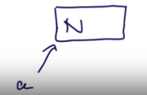
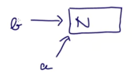
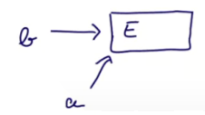
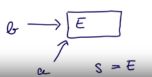
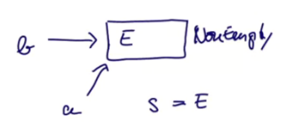

# Полиморфизм подтипов и обобщения

В прошлые разы мы уже посмотрели две формы полиморфизма. Одной было *полиморфизм подтипов* (subtyping), а второй - *обобщения* (generics). Полиморфизм подтипов обычно связывают с ООП, а вот генерики - с функциональной парадигмой. 

В этом уроке разберёмся, когда один тип может быть подтипом другого. Метод определния такой возможности называется **Принцип подстановки Барбары Лисков (Liscov Substitution Principle)**.

### Принцип заключается в следующем:

*Функции, которые используют базовый тип, должны иметь возможность использовать подтипы базового типа, не зная об этом.*

### Итак, мы знаем две формы полиморфизма:

- Полиморфизм подтипов (это когда можно передать подтип туда, где нужен базовый тип);
- Обобщения (это когда мы можем параметризовать одни типы другими).

### Мы посмотрим на эти концепции с точки зрения двух понятий:

- Границы действия (bounds) - насколько "широко" мы можем подставлять подтипы базового типа;
- Вариантность (variance) - как параметризованные типы ведут себя при создании подтипа.


## Пример

Определим метод `assertAllPos` который:

- Берёт IntSet;
- Возвращает IntSet если все его элементы положительны;
- Выбрасывает исключение в ином случае.

IntSet обсуждался в [упражнении ClassHierarchies](../../Week%203/Projects/ClassHierarchies/src/scala/main/Main.scala) в **Неделе 3**. Там были такие сигнатуры:

```scala
abstract class IntSet 
object Empty extends IntSet
class NonEmpty(elem: Int, left: IntSet, right: IntSet) extends IntSet 
```

Какой тип дать ему? Например, `def assertAllPos(s: IntSet): IntSet`

Вроде это работает. А можно быть более точным?

Мы видим, что он, по сути, может быть двух видов:

```scala
assertAllPos(Empty) = Empty
assertAllPos(NonEmpty) = NonEmpty // или Exception
```

Однако, это знание никак не отображено в типе здесь, а оно может улучшить понимание кода другим разработчиком.


## Границы типов

Можно явно описать, что `assertAllPos` приводит Empty к Empty, а NonEmpty к NonEmpty:

```scala
def assertAllPos[S <: IntSet](r: S): S = ...
```

Знак `<: IntSet` это **верхняя граница** параметра типа S:

- `S <: T` значит, что *S это подтип T*;

В Scala есть и *нижняя граница*, но она довольно бесполезная большую часть времени (смотри 4.4, если жить надоело). Например: `[S >: NonEmpty]`. S может быть только супертипом NonEmpty. Так что S может быть NonEmpty, IntSet, AnyRef или Any:

- `S >: T` значит, что *S это супертип T или T это подтип S*.

Позже мы обсудим, для чего это может быть полезным. 

Наконец, можно писать и так:

`[S >: NonEmpty <: IntSet]`

В этом случае S снизу ограничена `NonEmpty`, а сверху `IntSet`. 

### Ковариантность

Теперь нужно обсудить следующее. Предположим, у нас есть:

```scala
NonEmpty <: IntSet
```

Значит ли это, что:

```scala
List[NonEmpty] <: List[IntSet]
```

Интуитивно это делает смысл. Лист непустых сетов это особый случай листа абстрактных сетов. Мы называем такие типы **ковариантными** потому что их subtyping меняется с переданным параметром. 

Имеет ли ковариантность смысл для всех типов, а не только `List`-ов?


## Проблематика Java

Для переспективы посмотрим на массивы Java:

- Массив типов T в Java пишется как `T[]`;
- В Scala мы параметризуем массив как `Array[T]`.

Массивы в Java ковариантны, поэтому можно считать `NonEmpty[] <: IntSet[]`.

Но оказывается, что ковариантность массивов может вызывать проблемы:

```java
NonEmpty[] a = new NonEmpty[]{new NonEmpty(1, Empty, Empty)}
IntSet[] b = a

b[0] = Empty // ArrayStoreException
NonEmpty s = a[0]
```

В последней линии мы передали `Empty` в переменную типа `NonEmpty`. Разберёмся по шагам, что же пошло не так:

- Создаём массив NonEmpty (первый элемент будет NonEmpty):



- Создаём новую ссылку на него:



- Мы назначем Empty первому элементу B. Мы можем так поступить потому что b стал IntSet, что является супертипом NonEmpty и Empty:



- Теперь a[0] является Empty, а не NonEmpty, как требует `s`. Компилятор пропустит эту ошибку, ведь с точки зрения типов всё хорошо:



В рантайме мы получим исключение при попытке присвоить `b[0] Empty`, т.к. Java хранит тег типа (type tag), с которым *массив был создан*. Поэтому назначение по ссылке не сменит его тип в рантайме:




Это выглядит как плохая практика. Вместо ошибки компиляции мы получаем ошибку выполнения. К тому же, массив постоянно проверяет, какое значение в него кладётся. Поэтому можно сказать, что ковариантность массивов - это плохое решение с точки зрения дизайна. Зачем же это сделано?

Они хотели достичь возможности писать методы вроде, которые будут срабатывать для *любых* массивов. В старых версиях Java это достигалось вот так: `sort(Object[] a)`. Однако, начиная примерно с Java 5 началось использование обобщённых типов.


## Проблематика Scala

Перепишем проблемный массив на Scala:

```scala
val a: Array[NonEmpty] = Array(new NonEmpty(1, Empty, Empty))
val b: Array[IntSet] = a
b(0) = Empty
val s: NonEmpty = a(0)
```

В Scala будет Type Error на этапе компиляции на строчке 2. Дело в том, что в Scala массивы нековариантны.


## Выводы

Так в каких же случаях стоит уточнять, что тип может быть подтипом?

Принцип Барбары Лисков говорит нам, когда тип может быть подтипом:

- Если `A <: B` - тогда всё, что можно сделать со *значением* типа `B` должно быть возможно сделать со *значением* типа `A`. Так работают интерфейсы и наследование в целом. Все дети интерфейса B будут иметь некоторые одинаковые методы. 


