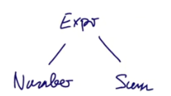
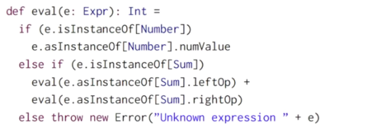

# Декомпозиция

Важная проблема программирования - декомпозиция. Например, у вас есть иерархия классов и вы хотите построить дерево-подобную структуру из объектов этих классов. Как построить это дерево? Как понять, какие элементы должны быть в нём? Как получать доступ к ним? 

Посмотрим на пример.

Предположим, мы хотим написать небольшой интерпретатор арифметических действий. Ограничим себя только номерами и сложением.

Выражения могут быть презентованы как иерархия классов с базовым трейтом `Expr` и двумя сабклассами - `Number` и `Sum`. Чтобы работать с выраженяими, нужно знать их форму и их компоненты.

Это приводит нас к следующей имплементации:



Важно то, что мы хотим знать наверняка, является ли какой-либо элемент Number или Summ, поэтому в трейте Expr имеются булевы `isNumber` и `isSum`:

```scala
trait Expr {
  def isNumber: Boolean
  def isSum: Boolean
  
  ......
}

```

Если это Number, то мы хотим знать его значение - `numValue`. Если это Summ, то мы хотим знать его операнды - `leftOp` и `rightOp`:

```scala
class Number(n: Int) extends Expr {
  def isNumber: Boolean = true
  def isSum: Boolean = false
  def numValue: Int = n
  def leftOp: Expr = throw new Error("Number.leftOp")
  def rightOp: Expr = throw new Error("Number.rightOp")
}

class Sum(e1: Expr, e2: Expr) extends Expr{
  def isNumber: Boolean = false
  def isSum: Boolean = true
  def numValue: Int = throw new Error("Sum.numValue")
  def leftOp: Expr = e1
  def rightOp: Expr = e2
}
```

Теперь, когда у нас есть структура, можно что-то с этим сделать. Например, написать функцию вычисления:

```scala
def eval(e: Expr): Int = {
  if (e.isNumber) e.numValue
  else if (e.isSum) eval(e.leftOp) + eval(e.rightOp)
  else throw new Error("Unknown expression "+e)
}

val i = eval(new Sum(new Number(1), new Number(5)))
println(i) // 6
```

*Проблема:* писать все эти классификации и функции для доступа к этим классам быстро станет утомительным занятием. Мы только что написали пятнадцать методов, чтобы сложить два числа.

Вещи станут ещё хуже, если мы добавим другие формы выражений вроде:

```scala
class Prod(e1: Expr, e2: Expr) extends Expr  // e1 * e2
class Var(x: String) extends Expr  // Variable 'x' (буквы вроде x и y в математике)
```

Естественно, для описания этих классов придётся переделывать даже суперкласс, добавляя в него новые булевы выражения и эксепшены. 

Для добавления новых классов придётся добавить **25** новых методов. Это новые методы `isVar` и `isProd`. Кроме того, придётся написать метод, возвращающий `name` (у `Var` есть имя). Если продолжить добавлять новые классы - количество методов будет возрастать *квадратично*.

Можно ли найти другой путь, который сделает эту зависимость хотя бы не квадратичной?


## NON-SOLUTION: Type Tests and Type Casts

Решение-"хак" может использовать проверки типов и касты типов. Scala позволяет делать это используя методы класса `Any`:

```scala
def isInstanceOf[T]: Boolean  // проверяет тип объекта
def asInstanceOf[T]: T  // использует объект как если бы это был T
// бросает exception если T это не класс объекта
```

Но касты типов и в целом проверки типов в рантайме - это плохой стиль программирования и никогда не должен быть использован.

Например, можно написать так:



Плюс: нам не нужны методы-классификаторы, проверяющие класс, а методы доступа можно добавить только для классов, где есть значение.

Минус: это низкоуровнево (мы не абстрагированы от программы) и потецниально уязвимо.


## Решение 1: Объектно-ориентированная декомпозиция

Предположим, что всё, что мы хотим делать - это *вычислять* выражения. Тогда нужно только писать так:

```scala
trait Expr {
  def eval: Int
}

class Number(n: Int) extends Expr {
  def eval: Int = n
}

class Summ(e1: Expr, e2: Expr) extends Expr {
  def eval: Int = e1.eval + e2.eval
}
```

Но что, если завтра понадобится выводить значения? Тогда все новые методы можно определять в подклассах:

```scala
class NumberPrinter(n: Int) extends Number(n: Int) {
  def print: Unit = println(n)
}

object Main extends App {
  val n = new NumberPrinter(10)
  n.print // 10
  val nn = new Number(5)
  println(new Summ(n, nn).eval) // 15
}
```

Идея тут в том, что не нужно добавлять методы в уже имеющийся код.

**С другой стороны, ОО-декомпозиция обладает ограничениями.**

Что, если мы захотим упрощать выражения, например по правилу:

`a * b + a * c   ->   a * (b + c)`

Проблема в том, что это нелокальное упрощение, оно не может быть инкапсулировано в методе одного объекта. И мы возвращаемся к необходимости иметь методы доступа для всех сабклассов. Например, нужно проверять, что операнды вокруг + (чтобы упростить, они должны быть `product`).

ООП-Декомпозиция хороша для некоторых вещей, но не всегда спасает. В следующей лекции будет техника, решающая такую проблему.

