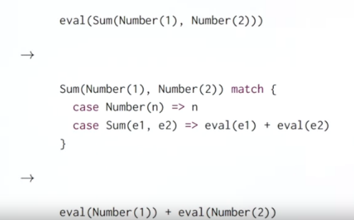
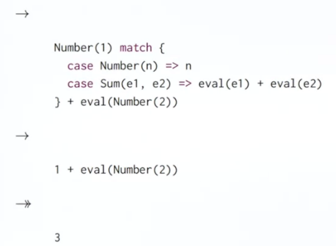

# Сопоставление с примером

Pattern Matching - это приём функционального программирования, отлично дополняющий декомпозицию в тех моментах, в которых она не справляется по тем или иным причинам.

Нашей задачей было найти общий путь для доступа к объектам в расширяющейся иерархии классов. Мы попробовали:

- Классификацию и методы доступа - квадратичное расширение;
- Проверки классов и каст классов - небезопасно и неабстрактно;
- ООП-декомпозицию - не всегда работает, нужно трогать все классы, чтобы добавить новый метод без расширения.

Как минимум, мы хотим иметь методы:

- Вычислить (Eval);
- Показать (Show);
- Упростить (Simplify).


На этой лекции мы узнаем, что такое Pattern Matching. Важное наблюдение: *единственной* целью проверок типов (и функций вроде `isNum`) и функций доступа было *обратить* процесс конструкции:

- Какой сабкласс был использован?
- Какие аргументы были переданы в конструктор?

Эта ситуация настолько часта во многих функциональных языках, что Scala автоматизирует её решение. 


## Case-классы (Классы-образцы)

Для PM используется концепция классов-образцов. Определение Case-класса похоже на обычное:

```scala
trait Expr
case class Number(n: Int) extends Expr
case class Sum(e1: Expr, e2: Expr) extends Expr
```

Как и реньше, мы определили трейт Expr и два конкретных сабкласса.


### Объекты-компаньоны

При создании кейз-класса в программе *автоматически* генерируются объекты-компаньоны этих классов:

```scala
object Number {
  def apply(n: Int) = new Number(n)
}

object Sum {
  def apply(e1: Expr, e2: Expr) = new Sum(e1, e2)
}
```

Т.к. объекты создаются "под капотом" автоматически - нет нужды писать `new`, достаточно просто `Number(1)`. Эти объекты автоматически содержат *фабричные методы*. Они автоматически создают элементы `Number` или `Sum` напрямую.

Но как нам получить доступ к членам этих классов (вроде `e1` или `n`)? Для этого и нужно использовать сопоставление с образцом.


### Сопоставление с образцом

PM - это обобщение конструкции `switch` из C/Java на иерархии классов.

Оно пишется по команде `match`.

Пример:

```scala
trait Expr
case class Number(n: Int) extends Expr
case class Sum(e1: Expr, e2: Expr) extends Expr

object Main extends App {
  def eval(e: Expr): Int = e match {
    case Number(n) => n
    case Sum(e1, e2) => eval(e1) + eval(e2)
  }

  println(eval(Number(10))) // 10
  println(eval(Sum(Number(10), Number(25)))) // 35
}
```

Объекты позволяют нам без написания вручную `new Number(10)` каждый раз передавать в `eval` новые объекты (мы же вызываем `apply`, а не передаём сами объекты). Значение, с которым сопоставляем (`e`), называется **селектор**.


### Правила сопоставления

- За `match` следует последовательность `case`-ов в форме `case pat => expr`;
- Каждый `case` ассоциирует выражение `expr` с паттерном `pat`;
- `MatchError` выбрасывается если ничего не подошло.

Только первый встреченный паттерн сработает.


### Из чего состоят паттерны

- Конструкторы (Number, Sum);
- Переменные (n, e1, e2);
- wildcard паттерн `_`;
- константы (1, true).

Переменные всегда начинаются с маленькой буквы.

Одна и та же переменная может встретиться в паттерне только один раз. Поэтому `Sum(x, x)` - неверный паттерн, нужно написать `Sum(x, y)`.

Имена констант начинаются с большой буквы с исключениями в виде `null`, `true`, `false` (зарезервированы). 

Эти правила нужны, чтобы отличать переменную, которую мы хотим использовать справа от `=>` от константы, которая просто содержит некоторое значение, с которым нужно сравнить.

Всё описанное можно комбинировать. Например, можно написать такой паттерн:

`case Sum(Number(1), Var(x)) => ...`

Здесь внутри x может быть что угодно, сама буква нужна только чтобы использовать её справа от стрелки. Если хотим проверить конкретно имя - можно передать `"x"`.


### Правила вычисления

Выражение вида:

```scala
e match { case p1 => e1 ... case pn => en }
```

1. Сопоставляет значение селектора `e` с паттернами `p1...pn` в том порядке, в котором они записаны.
2. Когда находится первое совпадение, всё выражение сопоставления переписывается с правой стороны.
3. Ссылки на переменные из паттерна заменяются соответствующими частями, взятыми из селектора.


### Что есть "Сопоставление"?

Зависит от типа паттерна:

- Паттерн конструктора `C(p1, ... pn)` сопоставляется со всеми значениями типа (можно передавать и подтипы по принципу Лисков) `C`, которые были переданы в виде аргументов в конструктор, сопоставимый паттернам `p1 ... p2` (ну типа если паттерн написан на три элемента - проверяется только конструктор с тремя элементами);
- Паттерн переменной `x` подходит любому значению и биндится в качестве имени переменной для этого значения;
- Паттерн константы `c` сопоставим только со значениями, которые равны `c` (по сути `==`).


### Пример:



Сначала мы понимаем, что `case Number(n)` не подходит, ведь в `eval` передан другой конструктор: `Sum(Number(1), Number(2))`.

Потом понимаем, что `case Sum(e1, e2)` подходит. Тогда мы маппим содержимое нашего селектора и получаем, что `e1 - это Number(1)`, а `e2 - это Number(2)`. После этого заново вызывается `eval`.

В этом случае селекторами уже становятся сами `Number(1)` и `Number(2)`, а они попадают в следующей итерации под первый `case`.

Затем всё повторяется уже для них:




## Определение сопоставления внутри классов:

```scala
trait Expr {
  def eval: Int = this match {
    case Number(n) => n
    case Sum(e1, e2) => e1.eval + e2.eval
  }
}

case class Number(n: Int) extends Expr
case class Sum(e1: Expr, e2: Expr) extends Expr

object Main extends App {
  println(Number(10).eval)  // 10
  println(Sum(Number(12), Number(324)).eval) // 336
}
```

Как видно из примера, в PM можно передавать даже ключевое слово `this`.


## Упражнение

Реализовать функцию Show, которая будет использовать PM и возвращать строковые представления.

```scala
def show: String = this match {
  case Number(n) => n.toString
  case Sum(e1, e2) => e1.show + "+" + e2.show
}

println(Sum(Number(12), Number(32)).show) // 12+32
```


## Упражнение (опционально и сложно)

Добавить case классы `Var` для переменных и `Prod` для умножения как предлагалось выше.

Изменить `show` так, чтобы она работала с умножением.

Основной челендж: **помнить о порядке действий**.

Пример:

```scala
Sum(Prod(2, Var("x")), Var("y"))
```

Требуемый вывод: `2 * x + y`

Но:

```scala
Prod(Sum(2, Var("x")), Var("y"))
```

Должно выводить: `(2 + x) * y`