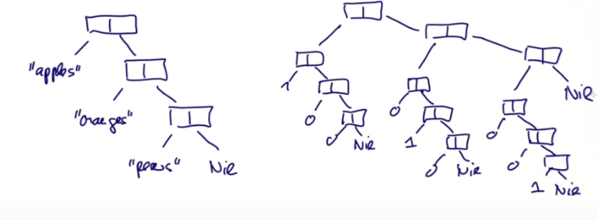

# Листы

Теперь посмотрим на коллекции. В основном, это будут неизменяемые коллекции, которые используются в функциональных программах.

Важной частью функциональных программ является **Tool box**, потому что это позволяет выражать алгоритмы высокоуровнево и кратко. 

Начнём с листов.


## Определение

Лист - это фундаментальная гомогенная (все элементы одного типа) рекурсивная (лист содержит листы) структура в функциональном программировании. Лист, имеющий `x1 ... xn` элементов записывается как `List(x1 ... xn)`. 

Пример:

```scala
val fruit = List("apples", "oranges", "pears")
val nums = List(1,2,3,4)
val diag3 = List(List(1,0,0), List(0,1,0), List(0,0,1))
val empty = List()
```

Есть два важных **отличия листов от массивов**:

- Листы неизменяемы - элементы листа нельзя менять;
- Листы рекурсивны, а массивы плоски. 


Листы в Scala выглядят именно так, как мы конструировали на одной из прошлых недель ()

Листы выглядят как набор ячеек, одна из которых - значение, а другая - следующий лист.



При этом, стандартные листы имеют куда больше действий над ними.


## Конструирование листов

Листы сконструированы из:

- Пустого листа `Nil`;
- Операции конструирования `::` (произносится `cons`):
  - `x :: xs` даёт новый лист с первым элементом `x` и следующим элементом `xs`.

Например:

```scala
fruit = "apples" :: ("oranges" :: ("pears" :: Nil))
nums = 1 :: (2 :: (3 :: (4 :: Nil)))
empty = Nil
```


## Соглашения Scala

Операторы, заканчивающиеся символом ":" ассоциативны в правую сторону (порядок начинается справа). Это значит, что:

```scala
A :: B :: C интерпретируется как A :: (B :: C)
```

Это нужно, чтобы избежать вложенности:

```scala
val nums = 1 :: 2 :: 3 :: 4 :: Nil
```

Из этого следует, что операторы с ":" на конце ещё отличаются тем, что они выглядят для компилятора как вызовы методов справа-налево:

```scala
Nil.::(4).::(3).::(2).::(1)
```

(Ну это понятно, ведь правый метод цепочки выполняется раньше, поэтому порядок такой).


## Операции над листами

Все операции над листами могут быть представлены через три самых фундаментальных:

- head;
- tail;
- isEmpty.

Они являются методами объектов типа List.


## Сопоставление с образцом

На листы работает паттерн матчинг.

- `Nil` - это константа
- `p :: ps` - это паттерн, который сопоставим с листом с `head`, совпавшей с `p` и с `tail`, совпавшим с `xs`;
- `List(p, ... ,pn)` то же, что `p1 :: ... :: pn :: Nil`.

Примеры:

- `1 :: 2 :: xs` Лист, который начинается с 1 и затем с 2, хвост любой;
- `x :: Nil` Лист длины 1;
- `List(x)` То же, что выше;
- `List()` То же, что просто `Nil`;
- `List(2 :: xs)` Лист, содержащий *другой лист*, начинающийся с 2.


## Сортировка

Предположим, мы хотим отсортировать лист чисел в порядке возрастания.

- Один из путей сортировать лист `List(7, 3, 9, 2)` - это сначала отсортировать хвост `List(3,9,2)` и получить `List(2,3,9)`;
- Затем вставить head в правильное место, чтобы получить `List(2, 3, 7, 9)`.

Это называется **сортировка вставками**:

```scala
def isort(xs: List[Int]): List[Int] = xs match {
  case List() => List()
  case y :: ys => insert(y, isort(ys))
}
```

Это один из самых типичных способов декомпозиции листа - в PM сначала проверить пустоту, а затем работать с ним.


## Упражнение

Но нам все ещё нужно определить функцию `insert`:

```scala
def insert(x: Int, xs: List[Int]): List[Int] = xs match {
  case List() => ???
  case y :: ys => ???
}
```

Завершить метод.
Какой худший случай сложности по длине листа N? (пропорционален N * N)

```scala
def insert(x: Int, xs: List[Int]): List[Int] = xs match {
  case List() => List(x)
  case y :: ys => if (x <= y) x :: xs else y :: insert(x, ys)
}
```

Сложность N * N не очень хороша, и есть способы сортировать листы лучше.


### Как работает сортировка:

```scala
def isort(xs: List[Int]): List[Int] = xs match {
  case List() => List()
  case y :: ys => insert(y, isort(ys))
}

def insert(x: Int, xs: List[Int]): List[Int] = xs match {
  case List() => List(x)
  case y :: ys => if (x <= y) x :: xs else y :: insert(x, ys)
}
```

Сортируется лист xs методом `isort`. Сначала от него перется первый элемент и вставляется в отсортированный хвост.

Сортировка же осуществляется в insert на уровне первых элементов листа. Если x <= y (y - это первый элемент уже хвоста), то он просто ставится в начало листа (мы же по возрастанию). Если нет - мы ставим y на первое место, а x вставляем уже в хвост после y.


