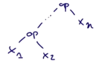
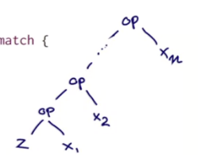
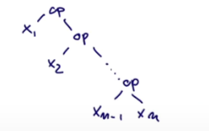
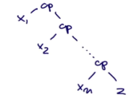

# Редукция (Складывание) листов

*Редукция - 1) Переход, сведе́ние сложного к простому. 2) Уменьшение, ослабление чего-н. (в каком-н. отношении).*

На этой лекции мы посмотрим новый вид high-order функций для работы с листами - fold combinators или reduce combinators. Есть несколько видов таких функций, но что между ними общего - это то, что они вставляют и дают операторы между примыкающими элементами листа.

Одной из частых операций над листами является комбинирование элементов листа, используя какой-то оператор. Например:

```scala
println(sum(List(1,2,3,4,5))) // 15

def sum(xs: List[Int]): Int = xs match {
  case Nil => 0
  case y :: ys => y + sum(ys)
}
```

Мы как бы "сложили" массив, поэтому такие функции и называются `fold combinators`.

Как же его обобщить?

## ReduceLeft

Этот метод вставляет заданный бинарный оператор между элементами листа:

```scala
println(List(1,2,3) reduceLeft ((x,y)=>x+y)) // 6
println(List(1,2,3) reduceLeft ((x,y)=>x*y)) // 6
```

## Короткий путь писать функции

Вместо `((x,y)=>x+y)` можно написать: (_ * _)

Получится следующим образом:

```scala
println(List(1,2,3) reduceLeft (_ + _))
println(List(1,2,3) reduceLeft (_ * _))
```

Работает это так: каждый `_` отражает новый параметр слева направо.


## FoldLeft

Функция `reduceLeft` определена на основе более общий функции, `foldLeft`. Это как `reduceLeft`, но принимает *аккумулятор*, z, в качестве дополнительного параметра, который возвращает `foldLeft`, если он вернул пустой лист.

ReduceLeft работает следующим образом:



`reduceLeft` не принимает пустые листы, а `foldLeft` - принимает.

```scala
println((List(1,2) foldLeft 25)(_ + _)) // 28
```

Как эти функции могут быть реализованы:

```scala
println(l.reduceLeft(_ * _)) // 120
println(l.foldLeft(0)(_ * _)) // 0
println(l.foldLeft(1)(_ * _)) // 120

class MyList[T](l: List[T]){


  def reduceLeft(op: (T,T) => T): T = l match {
    case Nil => throw new Error ("Nil.reduceLeft")
    case x :: xs => (xs foldLeft x)(op) // мы делаем первый элемент аккумулятором
  }

  def foldLeft[U](z: U)(op: (U, T) => U): U = l match {
    case Nil => z
    case x :: xs => (xs foldLeft op(z, x))(op)
  }

```

Для fold получается такая последовательность:



Z и x1 соотносятся по операции, затем результат op1 с x2 и т.д. Получается, что дерево берёт аккумулятор и складывает его с первым элементом, затем результат со вторым и так далее.

## FoldRight

Видно, что дерево собирается слева-направо. Такие операции подходят для деревьев, которые опираются на левую ветвь. Но есть и обратные функции, которые производят деревья, опирающиеся на правую ветвь: `foldRight` и `reduceRight`.

Первая операция берёт x1 и весь результат операции с хвостом. Получается, что операции начинаются с последнего элемента, а не первого.

Для reduce:



Для fold:



```scala
def reduceRight(op: (T,T) => T): T = l match {
  case Nil => throw new Error ("Nil.reduceLeft")
  case x::Nil => x
  case x::xs => op(x, xs.reduceRight(op))
}

def foldRight[U](z: U)(op: (T,U) => U): U = l match {
  case Nil => z
  case x :: xs => op(x, (xs foldRight z)(op))
}
```

## Разница между FoldLeft и FoldRight

Для операторов, которые ассоциативны и коммутативны разницы никакой (хотя и может наблюдаться разница в эффективности). Но иногда они отличаются. 

Например:

```scala
def concat[T](xs: List[T], ys: List[T]): List[T] =
  (xs foldRight ys)(_ :: _)
```

В зависимости от направления складывания листы соединятся по-разному.

Для складывания вправо:


Проблема в том, что при складывании вправо оператор работает следующим образом:

```scala
val m = 5 :: List(1)
//val n = List(1) :: 5 // cannot resolve ::


op: (T,U) => U
```

Сюда попадёт элемент X типа T (этот тип совпадает с типом Листа, поэтому элемент List[Int] равен Int), а U будет листом. 

Но при складывании влево произойдёт попытка прибавить к листу, а такой функции нет.

```scala
op: (U, T) => U
```

Здесь в U попадёт лист, а у него нет метода `::`.

