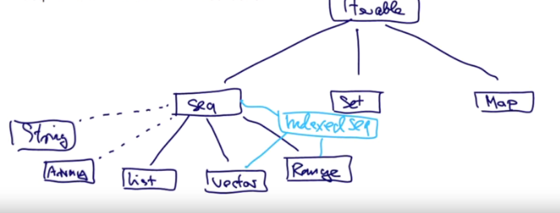
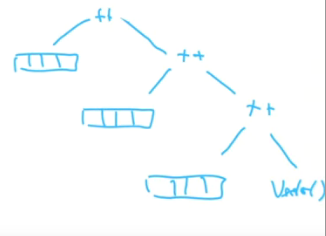

# Комбинаторный поиск и выражения For

В этой лекции мы узнаем, как работать со вложенными последовательностями, решая проблему комбинаторного поиска.

*Комбинаторный поиск — это поиск и подсчет количества числа комбинаций, которые можно составить из заданных элементов, соблюдая заданные условия. Применяется в решении задач теории вероятностей и математической статистики.*

Мы посмотрим удобное выражение For, которое можно применять для подобных проблем.

Функции высшего порядка обычно являются заменой для циклов из императивных языков. Программы, использующие множество циклов в императивном языке можно зачастую переписать с использованием комбинаций этих функций высшего порядка.

## Посмотрим на пример:

Имея положительное число n, найти все пары положительных чисел i и j с `1 <= j < i < n` такие что `i + j` - простое. Например, если n=7, то пары будут:

|   ||||||||
| :- |:-:|:-:|:-:|:-:|:-:|:-:|:-:|
|i    |2|3|4|4|5|6|6|
|j    |1|2|1|3|2|1|5|
|i+j  |3|5|5|7|7|7|11|

В императивном языке, скорее всего, потребовалось бы два вложенных цикла - для i и j, с тестом, является ли их сумма простым числом. И ещё нужен бы был какой-нибудь буфер, чтобы собирать результаты. 

В функциональном языке мы бы генерировали структуру данных бит за битом пока бы не достигли нужной структуры:

- Сгенерировать последовательность всех пар чисел (i, j) таких, что `1 <= j < i < n`;
- Отфильтровать пары, для которых `i+j` - простые числа.

Путь для этого:

- Сгенерировать интегеры i между 1 и n (excluded);
- Для каждого числа i сгенерировать лист пар (i,1)...(i, i-1).

Этого можно достичь, комбинируя until и map:

```scala
(1 until n) map (i => 
  (1 until i) map (j => (i, j)))
```

Для n=4 получится: 

```scala
IndexedSeq[IndexedSeq[(Int, Int)]] = Vector(Vector(), Vector((2,1)), Vector((3,1), (3,2)))
```

Т.к. на каждом шаге внешней map берётся i, а на внутренней он через until - для j всегда перебераются числа, меньшие i (точнее - i-1).

Для n=6:

```scala
IndexedSeq[IndexedSeq[(Int, Int)]] = Vector(Vector(), Vector((2,1)), Vector((3,1), (3,2)), Vector((4,1), (4,2), (4,3)), Vector((5,1), (5,2), (5,3), (5,4)))
```

Первый вектор пуст, потому что во внутренней map получается условие `1 until 1`. Почему мы получаем IndexedSeq с векторами? Это связано с тем, что мы использовали Range для начала генерации. Но Range (после выполнения map) не может хранить пары. Поэтому компилятор уходит вверх по иерархии и находит там IndexedSeq, каноничная имплементация которого - Вектор.




## Flatten

Но мы ведь хотим сгенерировать одну коллекцию, а не коллекцию векторов. Нам нужно сконкатенировать эти векторы в одну коллекцию пар. Для этого существует метод `flatten`:

```scala
val vectorFlatten = vectors.flatten

vectorFlatten: IndexedSeq[(Int, Int)] = Vector((2,1), (3,1), (3,2), (4,1), (4,2), (4,3), (5,1), (5,2), (5,3), (5,4), (6,1), (6,2), (6,3), (6,4), (6,5))
```

Этот метод может быть развёрнут:

```scala
(xss foldRight Seq[Int]())(_ ++ _)
```



С другой стороны, мы помним метод `flatMap`. И он работает следующим образом:

```scala
xs flatMap f = (xs map f).flatten
```

Получается, что мы можем переписать генерацию пар:

```scala
val vectorsFlat = (1 until n) flatMap (i =>
    (1 until i) map (j => (i,j)))

// и получить то же самое:
IndexedSeq[(Int, Int)] = Vector((2,1), (3,1), (3,2), (4,1), (4,2), (4,3), (5,1), (5,2), (5,3), (5,4), (6,1), (6,2), (6,3), (6,4), (6,5))
```

Осталось лишь отфильтровать по условию, которое осталось:

```scala
def isPrime(n: Int): Boolean =
  !(2 until n).exists(i => (n>0) & (n%i)==0)

vectorsFlat filter (pair => isPrime(pair._1 + pair._2))
```

Ответ:

```scala
Vector((2,1), (3,2), (4,1), (4,3), (5,2), (6,1), (6,5))
```

Мы получили то же самое, что было в таблице выше.


## Хочется попроще

Метод работает, но есть ли возможность сделать его более читаемым? Ну, мы можем разбить это на несколько именованных результатов. Это в принципе хорошая практика. Но есть лучший способ для выражения подобных проблем на более высокоуровневом определении, которое проще читать.


## For-Expressions

Мы поняли, что map, filter и прочее предоставляет удобные способы для манипуляции с коллекциями. Но иногда уровень запутанности возрастает вместе с ними. Поэтому Scala имеет `for`-выражения.


## Пример использования

```scala
for (i <- 1 to 10 if i>8) yield i  // Vector(9, 10)

// эквивалент:
(1 to 10) filter (i => i>8)  // Vector(9, 10)
```

Или более сложный пример:

```scala
val persons = List(Person("John", 22), Person("Sam", 43), Person("Lena", 23), Person("James", 31))
for (p <- persons if p.age < 30) yield p.name  // List(John, Lena)

// аналог:
persons filter(p => p.age <> 30) map (p => p.name)
```

For-нотации похожи на циклы for в императивных языках, но есть важное отличие. For-loop работает с побочными эффектами, меняя что-то. For-выражение продуцирует новый результат каждый раз вместе с `yield`. 


## Синтаксис For

`for ( s ) yield e`

Где `s` это последовательность генераторов и фильтров, а `e` - выражение, которое возвращается после каждой итерации.

- Генератор пишется в форме `p <- e`, где p - это паттерн, а e - выражение, чье значение это коллекция;
- Фильтр в форме `if f` где `f` это булева функция;
- Последовательность должна начинатьс с генератора;
- Если в последовательности несколько генераторов, последние должны прогоняться быстрее первых.

Вместо `( s )` можно также использовать `{ s }`, и тогда генераторы и фильтры могут располагаться на нескольких строках.

```scala
val persons = List(Person("John", 22), Person("Sam", 43), Person("Lena", 23), Person("James", 31))

for {
  p <- persons
  if p.age < 30
  if p.name != "John"
} yield p.name

// List(Lena)
```

Перепишем нашу карту карт:

```scala
for {
  i <- 1 until n
  j <- 1 until i
  if isPrime(i + j)
} yield (i,j)


Vector((2,1), (3,2), (4,1), (4,3), (5,2), (6,1), (6,5))
```

А теперь перепишем произведение векторов из предыдущей лекции (у нас было две версии).

```scala
def scalarProduct(xs: Vector[Double], ys:Vector[Double]): Double =
  (xs zip ys).map{ case (x,y) => x * y}.sum

def scalarProduct(xs: Vector[Double], ys: Vector[Double]): Double =
  (xs zip ys).map(xy => xy._1 * xy._2).sum*

def scalarProductFor(xs: Vector[Double], ys:Vector[Double]): Double =
    (for {
      xy <- xs zip ys
    } yield xy._1 * xy._2 ).sum
```

Преподаватель написал:

```scala
def scalarProduct(xs: Vector[Double], ys: Vector[Double]): Double =
  (for ( (x,y) <- xs zip ys ) yield x * y ).sum
```