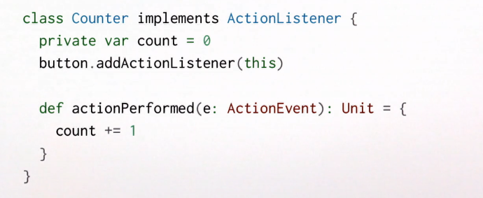

# Вступление

**Темы курса:**

- Обзор ФП;
- Абстрагирование над событиями: `futures`;
- Архитектура передачи сообщений: `actors`;
- Ошибки обработчиков: `supervisors`;
- Расширяемость: `распределённые акторы`;
- Абстрагирование над потоками: `reactive streams`, `flows`.

Любое современное приложение требует знаний реактивного программирования. 

Реактивное программирование - это набор программных техник и паттернов. 

Их появление связано с изменениями в требованиях к приложениям: отклик должен длиться милисекунды, а давнтайма быть не должно в приниципе. Данные приложений достигают петабайтов.

**Современные рактивные приложения:**

- event-driven (реагируют на события):
  - scalable (реагируют на загруженность);
  - resilient (реагируют на неудчное исполнение);
  - responsive (реагируют на пользователей).

## Event-driven:

Старые системы состояли из нескольких потоков, которые пользовались общим состоянием. Сильное связывание, тяжелая композиция.

Современные системы композируются из слабосвязанных хендлеров событий, события обрабатываются асинхронно без блокирования.

## Scalable:

- scale up: использовать параллелизм в мультиядерных системах (требуется минимум мутабельности);
- scale out: использовать несколько серверных нод (требуется максимум локационной прозрачности и отказоустойчивости).

Локационная прозрачность - части приложений могут быть на разных компьютерах или одном.

## Resilient

Как быстро приложение может восстановиться после падения.

Отказы могут быть:

- Софтварными;
- Хардварными;
- Сетевыми.

Должно быть продумано заранее, в готовое приложение тяжело или невозможно добавить.

Необходимо:

- Низкое связывание;
- Инкапсуляция мутабельных состояний;
- Иерархия с супервизором.

## Responsive

Это значит, что приложение предоставляет интеракции с юзером даже если оно загружено или сфейлилось.

# Event handling

Традиционно для обработки событий использовались callback-и. Например, через паттерн Observer в Java.

У такой модели есть несколько проблем:

- Сайдэффект в `var` = разделенное мутабельное состояние;
- Нельзя композировать;
- Быстро приводит к call-back hell.

# Как сделать лучше

Фундаментальные конструкции функционального программирования позволяют создавать композируемые абстракции.

- События - это first-class сущности;
- События представлены в виде **сообщений**;
- Хендлеры так же first-class сущности;
- Сложные хендлеры составлены из примитивных.

