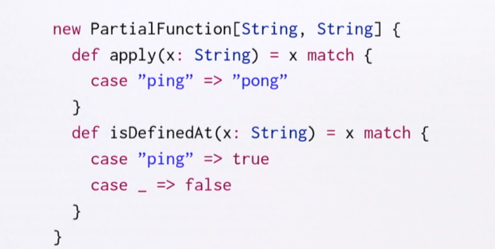
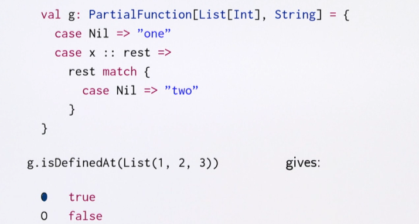

# Напоминание по функциям и паттерн матчингу

По большей части повторение `EPFL - Functional Programming in Scala Specialization/001 - Functional Programming Principles in Scala/Week 4/Lectures/4.6 - Pattern Matching.md`.

Некоторые моменты:

```scala
// лист кортежей
type Binding = (Int, String)
val l = List[Binding](1 -> "Josh", 2 -> "Josh", 3 -> "Stan")

val newl = l map {
  case (i, "Josh") => 0 -> "Josh"
  case (i, s) => i -> s
}

newl  // сделает для всех Josh-ей пару 0:  List((0,Josh), (0,Josh), (3,Stan))
```

Почему в map можно передавать `case (i, s) => i -> s`? Какой тип у такого параметра?

При работе с l map ожидает такой тип: `(f: Binding => B)`. 

Тип со стрелкой `=>`  - это функциональный тип. Проще говоря, это функция: `scala.Function1[Binding, B]`. `B` может быть любым, мы могли сделать карту `Binding => (Int, Int)`. Получается, что map ожидает функцию.

Передача туда `{ case (i, s) => i -> s }` под капотом превратится в

```scala
new Function1[Binding, B] {
  def apply(x: Binding) = x match {
    case (i, s) => i -> s
  }
}
```

Т.е. тип `{ case (i, s) => i -> s }` - это `Function1`.

```scala
// тип case - это функция
val f: String=> String = { case "ping" => "pong" }
f("ping")
//f("abc")  // match error

```

## Partial Functions

Хотелось бы заранее определять, подходит ли аргумент. PartialFunction позволяет проверить, определена ли функция для выбранного аргумента:

```scala
val f2: PartialFunction[String, String] = { case "ping" => "pong" }
f2.isDefinedAt("ping")  // true
f2.isDefinedAt("abc") // false
```

Под капотом она определяется таким образом:



`isDefinedAt` дополняется для каждого матча в `apply`.

## Упражнение 1

true

## Упражнение 2

В этой ситуации isDefined выдаст true, но мы всё равно получим MatchError. Это связано с тем, что isDefinedAt определяет только верхний уровень и не учитывает вложенности. `MatchError` прилетит уже из другой Function1, которую мы не определяли как `PartialFunction`.

