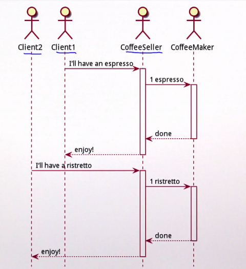
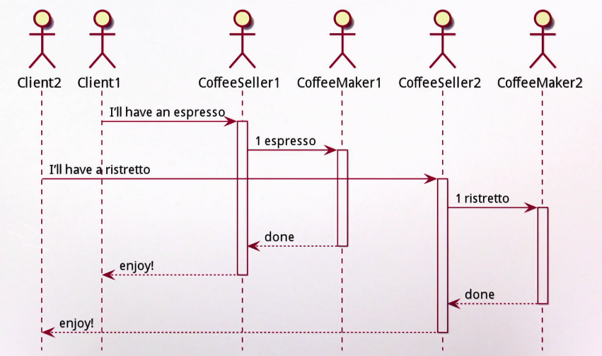
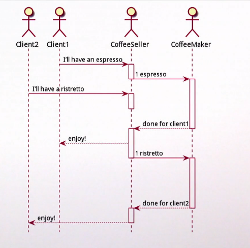
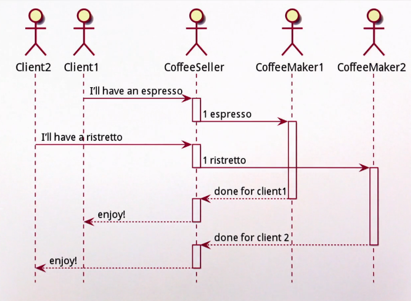

# Асинхронное программирование

## Синхронная обработка

Синхронная обработка - это обработка одного за другим:



Клиенты стоят в очереди, а продавец кофе всегда ждёт кофемейкера (он *блокирован* кофемейкером). Продавец не делает ничего полезного, а второй клиент ждёт освобождения.

Если мы хотим расширить синхронную модель, придётся не только добавить воркера, но и контроллер, т.к. первый контроллер всё равно блокирован своим воркером:




## Асинхронная

Контроллер не ждёт воркер, а накапливает у себя заказы (очередь). Когда воркер освободился - он передаёт следующий заказ. Таким образом, он не блокируется и всегда готов принимать заказы.



Расширяемость не требует новый контроллер, можно добавлять воркеры одному контроллеру:




## Общие приницпы

Выполнение вычисления в *другом* вычислительном ресурсе без ожидания его окончания.

Как писать асинхронные программы?

```scala
def coffeeBreak(): Unit = {
  val coffee = makeCoffee()  // async
  drink(coffee)
  chat()
}
```

Здесь есть опасность начать пить кофе до того, как оно будет готово (мы ведь не ждём воркера).

Как это исправить?

Простейший путь - использовать *callback*-и:

```scala
def makeCoffee(coffeeDone: Coffee => Unit): Unit = {  // async
  val coffee = ...
  coffeeDone(coffee)
}

def coffeeBreak(): Unit = {
  makeCoffee { coffee => 
    drink(coffee)
  }
  chat()
}
```

Тогда `makeCoffee` принимает функцию, которую она *вызовет* в какой-то момент. 

На нашей стороне drink вызывается внутри коллбека, что гарантирует выпивание кофе только после его готовности.

### Обобщение

Синхронная сигнатура может быть превращена в асинхронную через:

- Возврат Unit;
- Принятие в качестве параметра *продолжения* (continuation), которое определяет, что делать после вычисления возвратного значения.

## Мутабельность

Как создать два кофе?

```scala
def makeTwoCoffee(coffeesDone: (Coffee, Coffee) => Unit): Unit = {
  var firstCoffee: Option[Coffee] = None


  val k = { coffee: Coffee => 
    firstCoffee match {
      case None => firstCoffee = Some(coffee)
      case Some(coffee2) => coffeesDone(coffee, coffee2)
    }
  }

  /** Мы не знаем, какой вызов будет завершён раньше */
  makeCoffee(k)
  makeCoffee(k)
}
```

Если мы не знаем, какой коллбак будет вызван раньше (от первого или второго вызова makeCoffee), поэтому мы используем флаг firstCoffee. Если он готов - то следующий вызов коллбака будет точно вторым, а это значит, что можно делать возврат двух кофе.


## Routine

Но как понять, когда закончится `coffeeBreak`, если и он асинхронный? Он ведь ничего не возвращает. Придётся и в него передавать колбек. 

Для такого используются рутины. 

```scala
def workRoutine(workDone: Work => Unit): Unit = {
  work {
    work1 =>
      coffeeBreak {_ => 
        work { work2 =>
          workDone(work1 + work2)
        }
      }
  }
}
```

Они описывают последовательность асинхронных вызовов. 

## Ошибки обработки

Синхронные выдают Exception-ы. Что, если асинхронные обработки упадут с ошибкой? В асинхронной обработке исполняющий тред не может знать об эксепшенах, которые возникли в других тредах или на удалённой машине. И нам нужен способ просигнализировать о неудаче.

Один из путей - передавать в коллбак Try:

```scala
def makeCoffee(coffeeDone: Try[Coffee] => Unit): Unit = ...
```