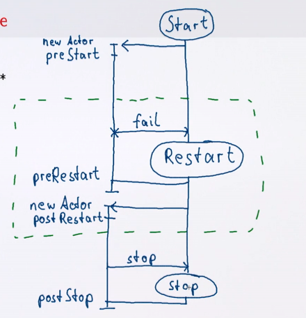

# Обработка неудач с акторами

Модель обработки ошибок взята из Эрланга и основывается на **супервизоре**. Если случилась ошибка, она перехватывается и делегируется супервизору.

### Куда должны идти ошибки?

- Они должны быть представлены как ошибки (эксепшен надо представить как сообщение);
- Они должны быть отосланы на какой-то известный адрес (например, родителю или специальному актору).

### Акторная модель антропоморфна:

- Команды акторов (системы);
- Ошибки отдельных акторов обрабатывает лидер команды (специальный актор).

Свойство *Resilience*(гибкость) означает самовосстановление акторных систем. Это основывается на упаковке (эксепшен упакован во что-то) и делегации:

- Упавший актор отключается или перезапускает;
- Решение принимает другой актор;
- Управляемые акторы образуют структуру дерева;
- Супервизор создаёт своих подчинённых.


Пример супервизора:

```scala

class Manager extends Actor {
  // по дефолту стратегия - перезапускать всех детей
  override val supervisorStrategy = OneForOneStrategy() {
    case _: DBException => Restart
    case _: ActorKilledException => Stop
    case _: ServiceDownException => Escalate  // отправляет своему супервизору
  }
  ...
  context.actorOf(Props[DBActor], "db")
  context.actorOf(Props[ImportantServiceActor], "service")
  ...
}

```

Этот актор полагается на `ImportantServiceActor`, но не может запускать его сам. Поэтому он эскалирует его перезапуск (или остановку) своему супервизору.

Сообщения об ошибках являются сообщениями, поэтому, пока актор их обрабатывает, он не принимает ничего другого. В этом примере мы проверяем, как часто перезапускался конкретный актор. Если перезапуски актора не помогают - мы его стопаем.

```scala

class Manager extends Actor {

  var restarts = Map.empty[ActorRef, Int].withDefaultValue(0)

  override val supervisorStrategy = OneForOneStrategy() {
    case _: DBException =>
      restarts(sender) match {
        case toomany if toomany > 10 =>
          restarts -= sender; Stop
        case n =>
          restarts = restarts.updated(sender, n + 1); Restart
      }
  }
}
```

## Стратегии обработки

- OneForOneStrategy - решение затрагивает конкретный актор по отдельности;
- AllForOneStrategy - решение затрагивает всех детей одновременно.

Эти стратегии позволяют легко задать количество рестартов в какое-то временное окно:

```scala
OneForOneStrategy(maxNrOfRestarts = 10, withinTimeRange = 1.minute) {
  case _: DBException => Restart   // станет Stop после 10 раз независимо от того, что тут было
}
```

## Actor Identity

Перезапуск через рестарт требует стабильного идентификатора (просто ссылка меняется, а кроме родителя об этом никто не знает).

- В Akka ActorRef **не меняется** после рестарта;
- В Erlang используется имя для PID.


## Рестарт

Что означает рестарт?

- Ожидаемые ошибки явно обработаны;
- Неожиданные ошибки говорят о неверном состоянии;
- Рестарт возвращает состояние к начальному.


## Жизненный цикл Актора:



- start
  - Создание инстанса
  - Запуск конструктора актора
  - preStart (до первого сообщения, но сообщения уже приходят и копятся)

- (restart)*
  - preRestart (инстанс уничтожается, но ссылка и очередь сообщений остаются)
  - Создаётся новый актор
  - postRestart

- stop
  - postStop 
  - termination

Сообщение, которое вызвало ошибку - второй раз не обрабатывается, его уже нет в очереди и в целом оно может снова вызвать ошибку.


## Дефолтный цикл

Дефолтные методы можно переписать

```scala
class DBActor extends Actor {
  val db = DB.openConnection(...)

  override def postStop(): Unit = {
    db.close()
  }
}
```

Проблема рестарта в том, что нужно помнить о внешних ресурсах. В этом примере рестарт реализован верно. Без явного закрытия коннекта - сам коннект не будет перезапущен, ведь это не часть актора.

`preStart` позволяет открывать ресурсы до начала обработки сообщений:

```scala
class Listener(source: ActorRef) extends Actor {
  override def preStart() { source ! RegisterListener(self) }
  override def postStop() { source ! UnregisterListener(self) }
}
```

Детей актора нужно (при необходимости) вручную рестартить этими же методами, по дефолту они не рестартуют.

