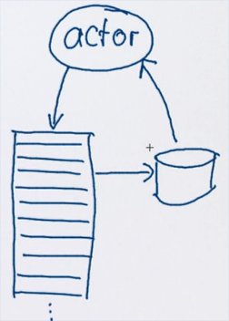
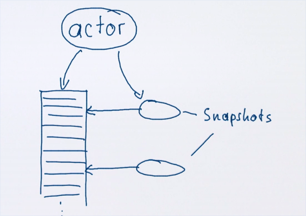
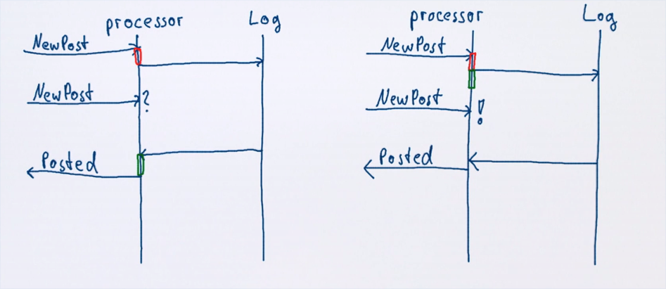

# Постоянное состояние акторов

Иногда требуется не потерять состояние актора при его перезапуске (при падении или перезагрузке компьютера).

Нам нужно сохранять результаты успешных обработок и восстановливать сфейленное.

Возможные решения:

- Зеркальное отражение содержимого актора в файле или т.п.(перезаписи);
- Сохранять изменения содержимого актора (дополнения истории).

Можно совместить два подхода:

- Сохранять все изменения состояния актора в историю;
- Записывать эту историю в какую-то БД в оффлайн-режиме;
- При перезапуске актора применить последнюю запись (это намного быстрее последовательного применения всего)



## Снапшоты

Снапшоты работают примерно тем же образом:




## Сохранение состояния акторов

- Command-sourcing - сохранять каждое сообщение перед исполнением (чтобы не потерять её при фейле);
  - Для восстановления все сохраненные сообщения просто переслать заново;

Но ведь тогда актор начнёт заново слать сообщения, которые отсылал раньше. Сообщения в логе подписаны специальным серийником. Поэтому требуется специальная организация акторов. Логгер должен получать сообщения перед основым актором. Основной актор должен отсылать сообщения через специальный канал. Канал должен определять, были ли эти сообщения уже обработаны и ответить соответствующие.

- Event-sourcing - создавать запросы изменений (events) вместо модифицирования локального состояния, сохранять их и возвращать при необходимости.
  - Команды не проигрываются заново, просто воспроизводятся изменения, которые были произведены во время апдейта состояния;
  - Актор просто будет получать event-ы вместо исполнения команд заново;

Главное отличие - команды описывают что-то, что будет произведено далее, а ивенты - то, что уже является результатом работы команд.

Пример Event-ов - создание постов в социальной сети:

```scala
sealed trait Event
case class PostCreated(text: String) extends Event
case object QuotaReached extends Event

case class State(posts: Vector[String], disabled: Boolean) {
  def updated(e: Event): State = e match {
    case PostCreated(text) => copy(posts = posts :+ text)
    case QuotaReached      => copy(disabled = true)
  }
}
```

State инкапслуирован в классе State. Он умеет продцуировать следующий State. Актор мог бы быть таким:

```scala
class UserProcessor extends Actor {
  var state = State(Vector.empty, false)

  import UserProcessor._

  def receive = {
    case NewPost(text) => 
      if(!state.disabled)  // квота = 1, отключаем сразу
        emit(PostCreated(text), QuotaReached)

    // Сюда будут прилетать ивенты уже от логгера
    case e: Event =>
      state = state.updated(e)
  }

  def emit(events: Event*) = ... // отправка в лог, который вернёт Event обратно и попадёт в case e: Event
}

object UserProcessor {
  case class NewPost(text: String)
}

```

Проблема: стейт обновляется только после ответа от логгера, а между приходом сообщения и ответом от логгера может прийти новое сообщение. Таким образом, например, может быть превышена квота.

## Когда применять изменения?

- После отправки в лог (как выше);
- Перед отправкой в лог.



Во втором случае мы не покидаем актор между получением и записью поста, что предотвращает получение лишних сообщений. 

Есть и третий путь

- Второй способ + Ожидать сообщения об успехе от логгера перед записью (буферизация, скорость ниже)

Трейт `Stash`:

```scala
class UserProcessor extends Actor with Stash { // трейт для придерживания сообщений до какого-то момента
  var state = State(Vector.empty, false)

  import UserProcessor._

  def receive = {
    case NewPost(text) if !state.disabled =>
      emit(PostCreated(text), QuotaReached)
      context.become(waiting(2), discardOld = false) // discardOld - собирать сообщения в стак
  }

  /** Ждёт 2 ивентов */
  def waiting(n: Int): Receive = {
    case e: Event =>
      state = state.updated(e)
      if (n == 1) { 
        context.unbecome()  // 
        unstashAll() // переобработать события (они будут добавлены в мейлбокс ПЕРЕД текущими сообщениями и порядок сохранится)
      }
      else context.become(waiting(n - 1))
    case _ => stash()  // сохранять в стеш всё, что не подходит
  }


  def emit(events: Event*) = ... // отправка в лог, который вернёт Event обратно и попадёт в case e: Event
}


```


