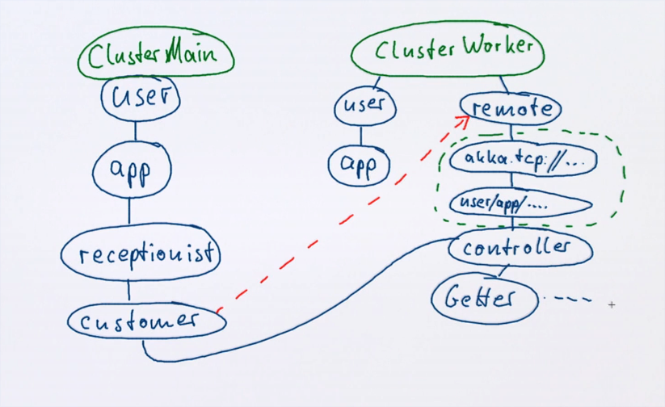
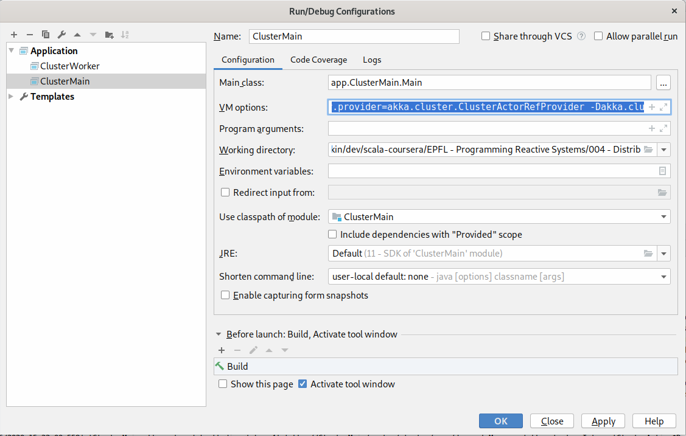
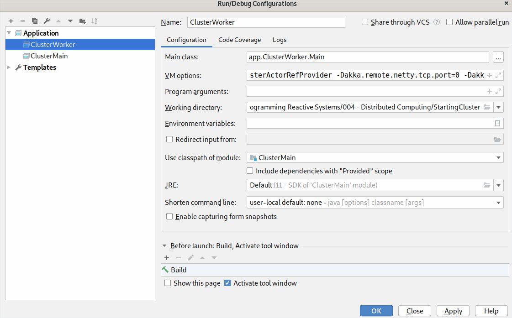

# Акторы - распределённые

Обычно до этого разные акторы мы выполняли на разных ядрах процессора. Но ничего не мешает выполнять их на разных компьютерах в разных сетях.

По сравнению с вычислениями локально:

- Данные больше не в общей памяти программы, ими можно обменяться только по значению (требуется сериализация);
- Ширина канала ниже;
- Высокая задержка;
- Частичные фейлы (сообщение ушло, а ответ потерялся и т.п.)
- Повреждения данных.

На одной машине примерно те же проблемы, когда дело касается нескольких процессов. Но импакта не так много.

Инкапсуляция акторов заставляет их выглядеть одинаково независимо от положения. Снаружи они всегда ActorRef.

`Location Transparency` - локационная прозрачность.

## Actor Paths

Каждый актор имеет имя:

```scala
val system = ActorSystem("Hello world")
val ref = system.actorOf(Props[Greeter], "greeter")
println(ref.path)
// akka://HelloWorld/user/greeter
```

В пути `/user/` лежат акторы, созданные через `actorOf`.

`akka://` означает локальный актор.

Пример удалённого:

```
akka.tcp://HelloWorld@10.2.4.6:6565/user/greeter
```

## ActorRef и ActorPath

- ActorRef - указатель на актор, который был запущен;
  - Можно использовать watch.
- ActorPath - полное имя, независимо от существования актора.
  - Можно только верить.

Пример ActorRef:

```
akka.tcp://HelloWorld@10.2.4.6:6565/user/greeter#2134234
```

## Resolving ActorPath

При коннекте к удалённым системам есть способ получить ActorRef используя ActorPath. Для этого есть метод `context.actorSelection(path: ActorPath)`.  

```scala
import akka.actor.{ Identify, ActorIdentity }
case class Resolve(path: ActorPath)
case class Resolved(path: ActorPath, ref: ActorRef)
case class NotResolved(path: ActorPath)

class Resolver extends Actor {
  def receive = {
    case Resolve(path) =>
      context.actorSelection(path) ! Identify((path, sender))

    case ActorIdentity((path, client), Some(ref)) => 
      client ! Resolved(path, ref)

    case ActorIdentity((path, client), None) =>
      client ! NotResolved(path)
  }
}
```

Этот метод создаёт *нечто*, чему можно отсылать что-то. Все акторы в akka по умолчанию умеют отвечать на сообщение `Identify((path, sender))`. В ответ на это сюда же может прилететь несколько вариантов:

```scala
case ActorIdentity((path, client), Some(ref)) => // Если актор существовал
  client ! Resolved(path, ref)

case ActorIdentity((path, client), None) =>  // Если не существовал
  client ! NotResolved(path)
```

ActorPath может быть относителен:

```scala
context.actorSelection("child/grandchild")
context.actorSelection("../sibling")
context.actorSelection("/user/app")  // текущий корень акторов
context.actorSelection("/user/controllers/*")  // бродкаст 
```

## Кластер

Кластер - это набор нод (узлов, акторных систем) в котором все члены работают в определённом соглашении. Они знают, кто есть в этом кластере и кого нет. Т.е. кластером считаются только те акторы, которые знают друг про друга. Если какой-то один из них знает об одном дополнительном - этот один дополнительный не будет частью кластера.

Они могут вместе работать над одной задачей.

## Создание кластера

Начинаем с превой ноды. Она объявляет себя кластером (join self).

Добавление ноды:

- Нода посылает реквест какому-нибудь члену кластера;
- Когда все текущие ноды знают про новую - она становится частью кластера.

Информация распространяется посредством *передачи слухов* (*gossip protocol*). 

Таким образом, в кластере не бывает главного актора.

## Практика

Зависимости:

```scala
libraryDependencies += "com.typesafe.akka" %% "akka-actor" % "2.6.3"
libraryDependencies += "com.typesafe.akka" %% "akka-cluster" % "2.6.3"
javaOptions += s"-Dconfig.file=${sourceDirectory.value}/application.conf"
```

Приложение LinkChecker по ремоту будет работать следующим образом:



Customer логически будет являться родителем для Controller, ведь он его создал.


## Как запускать с опциями множество акторных систем

Через конфигурации IDEA:

#### ClusterMain



VM options:

```
-Dakka.loglevel=INFO
-Dakka.actor.provider=akka.cluster.ClusterActorRefProvider
-Dakka.cluster.min-nr-of-members=2
```

#### ClusterWorker



VM options:

```
-Dakka.loglevel=INFO
-Dakka.actor.provider=akka.cluster.ClusterActorRefProvider
-Dakka.remote.netty.tcp.port=0
-Dakka.remote.artery.canonical.port=25521
-Dakka.cluster.auto-down=on
```

Классы Main просты, это просто стандартные запускалки. **Имена кластерных систем должны совпадать!**

```scala
object Main extends App {
  val system = ActorSystem("Cluster")
  val app = system.actorOf(Props(new ClusterMain))
  val rec = system.actorOf(Props(new ClusterReceptionist))


  var notExited = true
  while (notExited) {
    val link = scala.io.StdIn.readLine().filterNot(c => c == ' ')

    link match {
      case "quit" => notExited = false
      case s: String if s.nonEmpty => system.actorOf(Props(new Messenger(link, rec)))
      case _ => ()
    }
  }
  system.stop(rec)
  system.stop(app)
  system.terminate()
}


object Main extends App {
  val system = ActorSystem("Cluster")
  val app = system.actorOf(Props(new ClusterWorker))
}
```

Опции делают следующее:

- `Dakka.actor.provider=akka.cluster.ClusterActorRefProvider` - заставляет запускать акторы в контексте кластера. `context` получает новые методы;
- `Dakka.cluster.min-nr-of-members=2` - Кластер не запустится, пока в нём не будет хотя бы двух членов
- `Dakka.remote.netty.tcp.port=0` - Рандомный порт при старте у воркера
- `Dakka.cluster.auto-down=on` - 
- `Dakka.remote.artery.canonical.port=25521` - Сменить локальный сервер воркера (дефолтный 25520 будет занят)


Я написал вспомогательный актор для тестирования:

```scala
class Messenger(link: String, receptionist: ActorRef) extends Actor with ActorLogging {

  receptionist ! Get(link)
  log.info("Starting to wait")

  override def receive: Receive = {
    case Receptionist.Result(url, links) =>
      log.info(s"Result for $url: ${links.map(s => s + "\n")}")
      context.stop(self)
    case ClusterReceptionist.Failed(url, reason) =>
      log.error(s"Error for $url: $reason")
      context.stop(self)
    case Receptionist.Failed(url, reason) =>
      log.info(s"Result for $url: $reason")
      context.stop(self)
  }

}
```

И использую его из консоли:

```scala
var notExited = true
  while (notExited) {
    val link = scala.io.StdIn.readLine().filterNot(c => c == ' ')

    link match {
      case "quit" => notExited = false
      case s: String if s.nonEmpty => system.actorOf(Props(new Messenger(link, rec)))
      case _ => ()
    }
  }
```

## Ошибки LinkChecker

Пришлось пофиксить несколько проблем. Во-первых, ссылки могли быть распознаны неверно. Поправил контроллер, чтобы он не обрабатывал всякий мусор. Кроме того, тут же необходимо дописать отправку Result после окончания таймаута. Ранее он просто зависал без цели.

```scala
def receive: Receive = {
  
  case Check(url, depth) if url.nonEmpty & depth > -1 =>
    log.debug("{} checking {}", depth, url)
    if (!cache(url) && depth > 0)
      children += context.actorOf(Props(new Getter(url, depth - 1)))  // создали геттер
    cache += url  // считаем, что URL был пройден и записываем его

  case Check =>  // Не будем проверять пустые ссылки или глупые отрицательные depth
    context.parent ! Result(cache)

  case Getter.Done() =>
    children -= sender
    if (children.isEmpty) context.parent ! Result(cache)  // если все Getter-ы сделали Done - конец

  case ReceiveTimeout =>
    children foreach (_ ! Getter.Abort())
    context.parent ! Result(cache)
}
```


