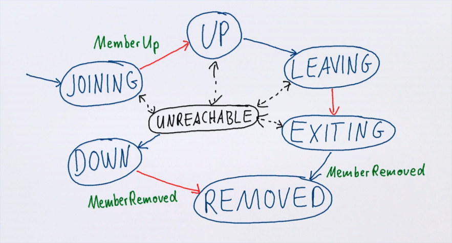
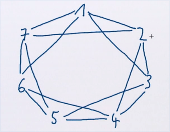

# Акторы - распределённые (часть 2)

Стадии соединения актора с кластером:



- Вход;

```scala
[INFO] [akkaMemberChanged][03/26/2020 17:22:03.909] [Cluster-akka.actor.internal-dispatcher-6] [Cluster(akka://Cluster)] Cluster Node [akka://Cluster@127.0.1.1:25520] - Node [akka://Cluster@127.0.1.1:25520] is JOINING itself (with roles [dc-default]) and forming new cluster
[INFO] [akkaMemberChanged][03/26/2020 17:22:13.861] [Cluster-akka.actor.internal-dispatcher-6] [Cluster(akka://Cluster)] Cluster Node [akka://Cluster@127.0.1.1:25520] - Node [akka://Cluster@127.0.1.1:25521] is JOINING, roles [dc-default]
```

- Включение;

```scala
[INFO] [akkaMemberChanged][03/26/2020 17:22:14.017] [Cluster-akka.actor.internal-dispatcher-2] [Cluster(akka://Cluster)] Cluster Node [akka://Cluster@127.0.1.1:25520] - Leader is moving node [akka://Cluster@127.0.1.1:25520] to [Up]
[INFO] [akkaMemberChanged][03/26/2020 17:22:14.017] [Cluster-akka.actor.internal-dispatcher-2] [Cluster(akka://Cluster)] Cluster Node [akka://Cluster@127.0.1.1:25520] - Leader is moving node [akka://Cluster@127.0.1.1:25521] to [Up]
[INFO] [03/26/2020 17:22:14.018] [Cluster-akka.actor.default-dispatcher-4] [akka://Cluster@127.0.1.1:25520/user/$a] Got new member request: Member(address = akka://Cluster@127.0.1.1:25520, status = Up)
[INFO] [03/26/2020 17:22:14.019] [Cluster-akka.actor.default-dispatcher-10] [akka://Cluster@127.0.1.1:25520/user/$a] Got new member request: Member(address = akka://Cluster@127.0.1.1:25521, status = Up)
```

- Выход из кластера;

```scala
[INFO] [akkaMemberChanged][03/26/2020 17:24:47.014] [Cluster-akka.actor.internal-dispatcher-2] [Cluster(akka://Cluster)] Cluster Node [akka://Cluster@127.0.1.1:25520] - Leader is moving node [akka://Cluster@127.0.1.1:25521] to [Exiting]
[INFO] [03/26/2020 17:24:47.032] [Cluster-akka.actor.internal-dispatcher-9] [Cluster(akka://Cluster)] Cluster Node [akka://Cluster@127.0.1.1:25520] - Exiting confirmed [akka://Cluster@127.0.1.1:25521]

```

- Удаление из кластера.

```scala
[INFO] [akkaMemberChanged][03/26/2020 17:24:48.035] [Cluster-akka.actor.internal-dispatcher-9] [Cluster(akka://Cluster)] Cluster Node [akka://Cluster@127.0.1.1:25520] - Leader is removing confirmed Exiting node [akka://Cluster@127.0.1.1:25521]
[INFO] [03/26/2020 17:24:48.054] [Cluster-akka.remote.default-remote-dispatcher-5] [Association(akka://Cluster)] Association to [akka://Cluster@127.0.1.1:25521] having UID [-1206785429663905109] has been stopped. All messages to this UID will be delivered to dead letters. Reason: ActorSystem terminated
```


Removed-актор не может вернуться в кластер уже никогда - в этот момент все получили Terminated (доставка Terminated гарантируется фреймворком). Такую ноду нужно перезапускать заново если нужно добавить её опять. 


Каждая нода мониторится другими (через *hearbeats*). Если одна из нод решила, что другая недоступна - она помечается недоступной для остальных нод. 

Если кластер большой - непрактично мониторить всех всеми. Поэтому в кластере мониторят друг друга только *соседи*. Соседи определяются порядком (в кластере каждая нода имеет некоторый идентификатор, под которой все ноды её знают):



Падение определяется по *нескольким* пропущенным хартбитам. Обнаруживший это монитор рандомно рассылает сообщения по кластеру об этом.


## Unreachability 

Нода может стать недоступной в любой момент. Это не значит, что она сразу удалена - это просто флаг. 

Переход из `Unreachable` в `Down` - это решение, управляемое политикой. Не всегда стоит сразу считать убитой ноду, которая недоступна. 

На это и влияет опция `Dakka.cluster.auto-down=on`.


## Terminated

Доставка Terminated гарантирована. Это сообщение может быть синтезировано на месте даже если отправитель умер. 