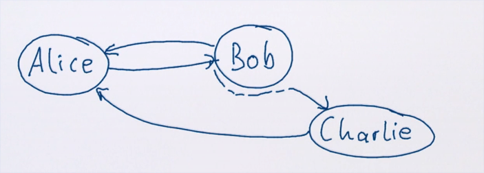

# Композиция актора

Описанием актора является его поведение (протокол). Акторы могут менять своё поведение, но полный набор сообщений остаётся прежним. Все возможные сообщения мы обычно описывали в объекте-компаньоне. Есть возможность проверить, может ли актор в приницпе когда-нибудь принять определённое сообщение. Однако, определить текущее поведение без специальных обвязок невозможно. 

Акторы ничего не возвращают, а их типы невозможно указать. Поэтому их нельзя композировать как обычные функции.

##  Протокольная композиция

Акторы используют протокольную композицию когда общаются друг с другом. Это позволяет делать примерно то же, что функции, но через сообщения. Помимо этого они умеют делать разные штуки. Например, записывать частоту прихода сообщений, дропать сообщения и т.п. Тут много свободы, но мало типобезопасности.

## Customer pattern

- Request-reply pattern - ответить отправителю (поэтому мы всегда имеем sender в контексте принятого сообщения);
- Адрес customer-а (клиента) записан в оригинальном запросе;

Мы можем передать в следующий актор адрес клиента. Тогда уже следующий актор сам ответит нашему клиенту. Возможность предоставить особый обратный адрес в сообщении позволяет динамически композировать акторы. 



В этой схеме Алиса может даже не подозревать о существовании Chralie. 

## Interceptors

Мы можем создавать перехватчики-прокси:

```scala
class AuditProxy(target: ActorRef) extends Actor with ActorLogging {
  def receive = {
    case msg =>
      log.info("Sent {} to {}", msg, target)
      target forward msg
  }
}
```

Метод `forward` позволяет не менять отправителя.

## Ask Pattern

Задал вопрос - получил ответ.

```scala
import akka.pattern.ask

class PostsByEmail(userService: ActorRef) extends Actor {

  implicit val timeout = Timeout(3.seconds)

  def receive = {
    case Get(email) =>
      (userService ? FindByEmail(email)).mapTo[UserInfo]  // Future[Any]
        .map(info => Result(info.posts.filter(_.email == email)))  // Future[Result]
        .recover { case ex = Failure(ex) }  // Обработка любых ошибок
        .pipeTo(sender)  // pipeTo разворачивает Future и отсылает как сообщение
  }
}
```

Импорт `pattern.ask` даёт имплисивную конверсию ActorRef, позволяющую использовать оператор `?` (`ask`). Этот оператор предполагает, что мы ожидаем *только один ответ*. Он позволяет напрямую обработать полученное сообщение, а не делать дополнительный `case` с ответом. Иначе бы мы делали так:

```scala
case Get(email) => userService ! FindByEmail(email)
case UserInfo => ...
```

Код `userService ? FindByEmail(email)` возвращаёт `Future[Any]`. Операция `mapTo` пытается провести `checked cast`. Если сработало - маппим. Мап выдает `Future[Result]`. В итоге `pipeTo` отошлёт распакованную Future. 

## Result Aggregations

Можно использовать ask для опроса нескольких акторов.

*For завершится успешно только если все шаги завершились успешно.*

```scala
class PostSummary(...) extends Actor {
  implicit val timeout = Timeout(500.millis)

  def receive = {
    case Get(postId, user, password) => 
      val response = for {
        status <- (publisher ? GetStatus(postId)).mapTo[PostStatus]
        text   <- (postStore ? Get(postId)).mapTo[Post]
        auth   <- (authService ? Login(user, password)).mapTo[AuthStatus]
      } yield
        if (auth.successful) Result(status, text)
        else Failure("not authorized")
    response pipeTo sender
  }
}
```

## Risk Delegation

- Создавать новых мелких воркеров на опасные таски (чтение с диска и т.п.);
- Применять watch на них;
- Сообщать об успехе или неудаче какому-то посреднику;
- Посредник должен отвечать клиенту (сам посредник не упадёт, ведь не делает ничего рискованного);
- Выключать каждый такой актор сразу после завершения своей мелкой таски (`stoppingStrategy`).


