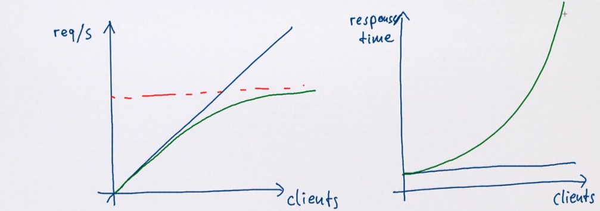
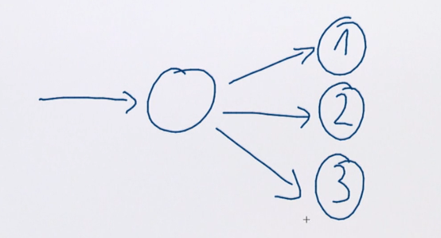
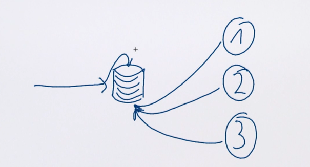

# Расширяемость

Расширяемость значит, что система остаётся быстрой, когда её использует несколько клиентов.

Производиетльности значит, что система быстра для одного клиента.

Akka фокусируется на расширяемости вместо производительности.

## Репликации акторов

Один актор обрабатывает одно сообщение за раз. Можно создавать множество акторов на множество сообщений.

Другой способ - создание реплик акторов. Если такие акторы не имеют состояния (stateless) - они могут работать над одним процессом конкурентно. 

Актор, который создан только чтобы передавать (**routing**) сообщения в пул воркеров называется **router**.

Передача сообщений в пулы воркеров может основываться на типах роутинга:

- stateful (round robin, smallest queue, adaptive, ...) (алгоритм роутинга сохраняет какое-то состояние, например счётчик)
- stateless (random, consistent hashing, ...)

## Round-Robin Routing

- Равное распределение сообщений;

Если какой-нибудь из акторов перезапускается - его ящик будет продолжать пополняться. В какой-то момент он будет обрабатывать больше сообщений, чем остальные.

## Smallest mailbox routing

- Воркеры должны быть локальными чтобы проверять размеры очередей;
- Меньше возможности дисбаланса;
- Высокая цена роутинга. Стоит использовать только если сами работы выполняются дольше, чем траверсинг через список детей.

## Shared work queue

- Воркеры локальны;
- Обычно модель основывается на пуллах из общей очереди заданий вместо отсылки роутером заданий.
- Самая лучшая скорость без дисбаланса - акторы сами регулирут себя

В Akka есть встроенный механизм для этого.

## Adaptive routing

- Оценивать работу акторов не по опросу очередей, а по времени работы/задержках/размерах очереди;
- Акторы сами присылают фидбеки о своём состоянии;
- Оценка может быть грубой (меньше раза в секунду);
- Воркеры могут быть на разных машинах.

## Random Routing

- Нет нагрузки от самого роутинга;
- Примерно одинаковое распределение;
- Может работать с несколькими роутерами одновременно;
- Может привести к дисбалансу.

## Consistent Hashing 

- Разделение по воркерам по какому-то критерию (например, по актору для каждого юзера); 
- Весь стейт, относящийся к одной категории, находится в одном месте;

Такой механизм может быть использован для репликаций стейтфул акторов.

# Выводы 

Дизайн акторов позволяет добиться вертикальной расширяемости за счёт асинхронного роутинга и горизонтальной за счёт локационной прозрачности.

