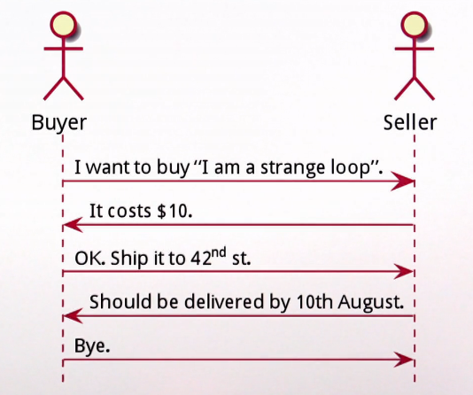
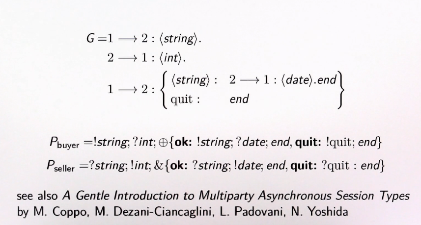

# Введение в протоколы

Акторы могут отправлять любые сообщения любым другим акторам. Мы можем совершать ошибки, когда отправляем сообщения, которые актор не может принять.

Протоколы бывают не только техническими. Например, протокол "этикета" предписывает ответить "спасибо" после того, как узнал дорогу.

Примерно так и работают протоколы в акторах.



Покупатель может и отказаться от покупки книги.

## Формальное описание

Формальное описание возможно через тип сессий (session types). 



На третьей строчке происходит ветвление - покупатель может уйти или купить книгу. 

Знак вопроса означает ожидание сообщения. Восклицательный знак означает отсылку сообщения.

## Тип канала

Протокол описывает, что и когда посылается.
Тип сообщения меняется на каждом шаге.

У нас есть две опции для моделирования такого поведения:

- Каждый собсеседник имеет отдельный канал для каждого собеседника;
- Один канал для каждого типа сообщений.

Типизированные языки программирования не умеют описывать изменения типов у одного объекта. Поэтому akka использует второй подход.


## Проблемы с линейной логикой

Протокол должен позволять ограничивать и количество выполнений. Например:

```scala
val channel = ...
channel.send(msg)
channel.send(msg)  // illegal
```

Обычные ЯП позволяют только добавлять знания. Например, если мы решили, что channel.send выполнится в первой строке, как мы можем показать, что второй вызов запрещён?

Линейная логика позволяет удалять знания. Позволяет использовать полученные факты только раз. Это что-то вроде разрешающего токена, который расходуется. 

Похожая механика (Афинные типы - ссылка использована максимум один раз) появились в C++11 и Rust.

