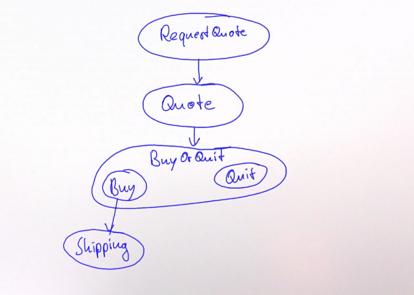

# Протоколы в Akka Typed

Как мы увидели, типизируются именно каналы коммуникации. 

Главная цель - ограничить `ActorRef` чтобы позволить отсылать только правильные сообщения. Это должно происходить по оператору `tell`.

- Добавить тип `ActorRef[T]`
- Использовать его с `tell`;
- Добавить тип понимаемых сообщений в трейт `Actor`;
- `ActorContext[T]` - контекст тоже должен знать свой тип.
  - `context.sender` больше не существует.

Такие изменения несовместимы с базовым кодом.

- Вместо типизированных акторов используются типизированные поведения `Behavior[T]`;
- Убрать вызов `system.actorOf` и требовать спцеиальное поведение-guardian;
- `ActorSystem[T]` это `ActorRef[T]` для этого guardian-а.

## Akka Typed: Hello World

Минимальный протокол - принять сообщение и остановиться

```scala
val greeter: Behavior[String] =
  Behaviors.receiveMessage[String] { whom => 
    println(s"Hello $whom!")
    Behaviors.stopped
  }
```

Фабрика поведения `Behaviors.receiveMessage` принимает два параметра - тип принимаемого сообщения и функцию. Функция создаёт следующее поведение.

Поведение можно запустить, поместив его в акторную систему:

```scala
object Hello extends App {
  val greeter: Behavior[String] = 
    Behaviors.receiveMessage[String] { whom => 
      println(s"Hello, $whom")
      Behaviors.stopped
    }

  // Система с примитивным guardian-ом и именем
  val system: ActorSystem[String] = ActorSystem(greeter, "helloworld")

  // Отправить сообщение guardian behavior
  system ! "world"
}
```

Акторная система тоже имеет тип `String`.

## Каналы с алгебраическими типами данных

Алгебраические типы данных в Scala - sealed trait с final классами/объектами.

```scala
sealed trait Greeter
final case class Greet(whom: String) extends Greeter
final case object Stop extends Greeter

val greeter: Behavior[Greeter] = 
  Behaviors.receiveMessage[Greeter] {
    case Greet(whom) =>
      println(s"Hello, $whom")
      Behaviros.same
    case Stop =>
      println("Shutting down...")
      Behaviors.stopped
  }
```

## Запуск программ с акторами

Лучший способ запускать программы с акторами - запустить `ActorSystem` и поместить код инициализации в guardian-поведение.

```scala
object Hello extends App {

// Собственно поведение
val greeter: Behavior[Greeter] = 
  Behaviors.receiveMessage[Greeter] {
    case Greet(whom) =>
      println(s"Hello, $whom")
      Behaviors.same
    case Stop =>
      println("Shutting down...")
      Behaviors.stopped
  }


// Акторная система с поведением
ActorSystem[Nothing](Behaviors.setup[Nothing] { ctx =>
  val greeterRef = ctx.spawn(greeter, "greeter")
  ctx.watch(greeterRef)  // death pact

  greeterRef ! Greet("world")
  greeterRef ! Greet("Helen")
  greeterRef ! Stop

  Behaviors.empty
}, "helloworld-system")
}
```

Пример ошибок типизации:

```scala
greeterRef ! "Test"

type mismatch;
 found   : String("Test")
 required: example.Greeter
```

Что происходит в этом блоке:

```scala
ActorSystem[Nothing](Behaviors.setup[Nothing] { ctx =>
  val greeterRef = ctx.spawn(greeter, "greeter")
  ctx.watch(greeterRef)  // death pact, подписываемся на уничтожение дочернего актора

  greeterRef ! Greet("world")
  greeterRef ! Stop

  Behaviors.empty  // Не обрабатываем пришедший Terminated(_) => Актор выключается вместе с дочерним
}, "helloworld-system")
}


/// Ранее

// Guardian-behavior - актор 1
val greeter: Behavior[String] = 
  Behaviors.receiveMessage[String] { whom => 
    println(s"Hello, $whom")
    Behaviors.stopped
  }

// Инициализация акторной системы из greeter-а, актор 2
val system: ActorSystem[String] = ActorSystem(greeter, "helloworld")
system ! "world"
```

Ранее мы создавали акторную систему через готовый Behavior (получалось 2 актора). Но мы можем создать промежуточный guardian-инициализатор, передав в акторную систему `Behaviors.setup[Nothing]`. Этот метод создаёт поведение, которое, при получении первого сообщения, запустит функцию в скобках (относительно какого-то контекста `ctx`). Эта функция может вернуть следующее поведение (но тут она возвращает empty).

Для чего эта штука? Она используется для создания greeter в контексте (`ctx.spawn`).

## Работа с типизированными ответами

Ответ типа T должен присылаться только на ActorRef[T] (ещё раз вспомним - `sender` больше нет в контексте). 

Нам нужен хранитель:

```scala
// Guardian актор будет уметь создавать новый гритер и выключаться
sealed trait Guardian

// На NewGreeter нужно отвечать с ActorRef на этот новый Greeter
// Поле replyTo позволяет принять ActorRef гритера

// Словами - replyTo это ActorRef, который принимает ActorRef
case class NewGreeter(replyTo: ActorRef[ActorRef[Greeter]]) extends Guardian
case object Shutdown extends Guardian


val guardian = Behaviors.receive[Guardian] {
  case (ctx, NewGreeter(replyTo)) =>
    val ref: ActorRef[Greeter] = ctx.spawnAnonymous(greeter)
    replyTo ! ref
    Behaviors.same
  case (_, Shutdown) =>
    Behaviors.stopped
}
```

Присылать в сообщении типизированные акторы позволяет создавать поведение "После того, как пришло это сообщение - можно ответить таким типом ответа":



На этом графике это показано стрелками. Например - в ответ на RequestQuote можно послать только Quote. Т.е. актор на той стороне присылает вместе с сообщением тип следующего ожидаемого сообщения.

## Описание протокола покупки книги


Модель сообщений:

```scala

case class RequestQuote(title: String, buyer: ActorRef[Quote])
case class Quote(price: BigDecimal, seller: ActorRef[BuyOrQuit])

sealed trait BuyOrQuit
case class Buy(address: Address, buyer: ActorRef[Shipping]) extends BuyOrQuit
case object Quit extends BuyOrQuit

case class Shipping(date: Date)

```