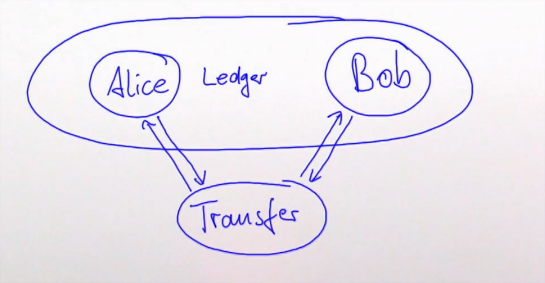

# Akka Typed Persistence 

Вспомним, что смысл был в запоминании изменений состояния. Такие изменения могут быть затем проиграны заново для восстановления состояния.

- Входящие команды могут или не могут вызывать изменения состояния;
- События сохраняются в журнале;
- Затем применяются.

Вспомним акторы для передачи денег в банке:




Посмотрим на акторную систему, которая будет работать для акторов:

```scala
ActorSystem(Behaviors.setup[Result] { ctx =>
  val ledger = ctx.spawn(Ledger.initial, "ledger")
  // Описываем передачу средств
  val config = TransferConfig(ledger, ctx.self, 1000.00, "Alice", "Bob")

  // Сам передатчик
  val transfer = ctx.spawn(PersistentBehaviors.receive(
    presistenceId = "transfer-1",  // Имя
    emptyState = AwaitingDebit(config),  // Стартовое состояние трансфера
    commandHandler = commandHandler,  // Обработчик команд
    eventHandler = eventHandler  // Обработчик событий
  ), "transfer")

  Behaviors.receiveMessage(_ => Behaviors.stopped)

}, "Persistence")

```

Как видно, `PersistentBehaviors` требует определения обработчиков.


## Переход команд и событий в состояния

Обработчики команд и событий должны работать с определёнными сущностями. Сущности управляющие (бизнес-логика):

```scala
sealed trait Ledger
case class Debit(account: String, amount: BigDecimal, replyTo: ActorRef[Result]) extends Ledger
case class Credit(accoutn: String, amount: BigDecimal, replyTo: ActorRef[Result]) extends Ledger
```

Команды:

```scala
sealed trait Command
case object DebitSuccess extends Command
case object DebitFailure extends Command
case object CreditSuccess extends Command
case object CreditFailure extends Command
case object Stop extends Command
```

Произошедшие события:

```scala
sealed trait Event
case object Aborted extends Event
case object DebitDone extends Event
case object CreditDone extends Event
case object RollbackStarted extends Event
case object RollbackFailed extends Event
case object RollbackFinished extends Event
```

Внутренние состояния могут быть:

```scala
sealed trait State
case class AwaitingDebit(config: TransferConfig) extends State
case class AwaitingCredit(config: TransferConfig) extends State
case class AwaitingRollback(config: TransferConfig) extends State
case class Finished(result: ActorRef[Result]) extends State
case class Failed(result: ActorRef[Result]) extends State
```

## Обработчики

### Обработчик событий

EventHandler по текущему состоянию и событию переключает состояния.


```scala
val eventHandler: (State, Event) => State = { (state, event) => 
  (state, event) match {
    case (AwaitingDebit(tc), DebitDone)           => AwaitingCredit(tc)
    case (AwaitingDebit(tc), Aborted)             => Failed(tc.result)

    case (AwaitingCredit(tc), CreditDone)         => Finished(tc.result)
    case (AwaitingCredit(tc), RollbackStarted)    => AwaitingRollback(tc)

    case (AwaitingRollback(tc), RollbackFinished) => Failed(tc.result)
    case (AwaitingRollback(tc), RollbackFailed)   => Failed(tc.result)

    case x                                        => throw new IllegalStateException(x.toString)
  }
}
```

### Обработчик команд

CommandHandler по внутреннему состоянию определяет, какое поведение активно в данный момент. Другие поведения - это тоже CommandHandler-ы.

```scala
val commandHandler: CommandHandler[Command, Event, State] = 
  CommandHandler.byState {
    case _: AwaitingDebit     => awaitingDebit
    case _: AwaitingCredit    => awaitingCredit
    case _: AwaitiginRollback => awaitingRollback
    case _                    => (_, _, _) => Effect.stop
  }
```

CommandHandler вдохновлен моделью, называемой "Конечный автомат" (*Finite-state machine*).

> *Конечный автомат - абстрактный автомат, число возможных внутренних состояний которого конечно.*


## Одноразовые адаптеры

Есть такая оговорка - результаты должны соответствовать запросу. Нельзя чтобы на AwaitingDebit пришёл CreditSuccess. Для этого мы будем создавать одноразовые адаптеры:

```scala
def adapter[T](ctx: ActorContext[Command], f: T => Command): ActorRef[T] = 
  ctx.spawnAnonymous(Behaviors.receiveMessage[T]{ msg =>
    ctx.self ! f(msg)
    Behaviors.stopped
  })
```

С этим адаптером мы можем работать дальше

## Awaiting Debit

```scala
def awaitingDebit: CommandHandler[Command, Event, State] = {
  
  case (ctx, AwaitingDebit(tc), DebitSuccess) => 
    Effect.persist(DebitDone).andThen { state =>  // Effect.persist - сохранить в персистивное хранилище
      // Следующая команда
      tc.ledger ! Credit(tc.to, tc.amount, adapter(ctx, {
        case Success => CreditSuccess
        case Failure => CreditFailure
      }))
    }

  /** Списания не было - просто отправляем фейл и стопаемся */
  case (ctx, AwaitingDebit(tc), DebitFailure) => 
    Effect.persist(Aborted)
      .andThen((state: State) => tc.result ! Failure)
      .andThenStop

  case x => throw new IllegalStateException(x.toString)
}
```


Осталось описать восстановление.

## Восстановление после ошибок

`PersistentBehaviors` восстановит состояние после ошибок. Стейт будет тем же, что и до ошибки. Но вот CommandHendler не является стейтом. Поэтому его нужно привести в правильное состояние вручную и исполнить (ведь до фейла актора кто-то послал ему команду и ждёт сообщения об успехе или неудаче).

```scala
PersistentBehaviors.receive(
  ///...
).onRecoveryCompleted {
  case (ctx, AwaitingDebit(tc)) =>
    ledger ! Debit(tc.from, tc.amount, adapter(ctx, {
      case Success => CreditSuccess
      case Failure => CreditFailure
    }))
  ///...
}
```

Например, если актор крешнулся просто перед отправкой ответа (хотя исполнил все действия):

```scala
PersistentBehaviors.receive(

).onRecoveryCompleted {
  case (ctx, Finished(result)) =>
    println("still finished")
    ctx.self ! CreditSuccess  // остановка самого себя пересылкой успеха
    result ! Success
  
  case (ctx, Failed(result)) =>
    println("still failed")
    ctx.self ! CreditSuccess 
    result ! Failure
}
```

Внутри `onRecoveryCompleted` **нельзя** выполнить ctx.stop(self), нужно отправить какое-то сообщение себе, если нужно стопнуться.

