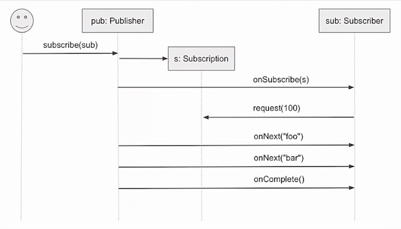

# Семантика реактивных потоков

Системы с асинхронными потоками нуждаются в **back-pressure** (**flow-control**). 

Flow-control - механизм контроля частоты, с которой через издатель(*upstream-publisher*) передаёт данные подписчику(*downstream-subscriber*) *согласно возможностям подписчика*. 

## Пример

Есть асинхронно пополняемая очреедь, из которой получает данные одна сущность. Мы не хотим переполнять её. К примеру, очередь работ на оценку и оценщик. Оценщик обрабатывает данные медленнее, чем они могут поступать.

В идеале мы должны процессить данные с той же скоростью, с которыми они поступают.

## Reactive Streams

Это решение специально создано для таких ситуаций. Это стандарт для **асинхронной обработки стримов с неблокирующим контролем потока**.

Проблема:

Блокирование может возникнуть когда у подписчика заполнилась очередь. Отправитель должен ждать, пока его сообщение будет принято подписчиком. 

Стандарт определяет:

- Правила взаимодействия (Спецификация);
- Набор типов (SPI);
- Оценочные средства (Technology Compliance (test) Kit - TCK).

Пример работы:

## Сигналы и сообщения

Хотя на картинке обмен выглядит как вызов методов - потоки работают с сигналами (или сообщениями). Тут та же идея, что у акторов. У вызовов методов снова нет типов (`Unit`). 

## Синхронизация издателя и подписчика

Подписчик может запросить элемент (`request(1)`). Стрим получил один запрос. Он отправил на него `onNext("foo")` и там снова ноль запросов. Затем подписчик снова сделал запрос... Такой алгоритм не очень оптимален - подписчик каждый раз пустует и ждёт следующее сообщение. В реальности подписчик за раз запрашивает *так много данных, сколько он, предположительно, может обработать*. Т.е. пока он обрабатывает один элемент - в его очередь приходят следующие. Всё асинхронно. Если потребитель не успевает - он перестаёт слать запросы на данные. Тогда издатель простаивает. Это и есть механизм `Back-pressure`. 

## Менеджмент ресурсов

Предположим, издатель отдаёт подписчику некоторый файл построчно. Когда он должен прекратить держать у себя его дескриптор? Для этого у нас есть сигнал `cancel`. Это сигнал говорит о том, что подписчик собирается самоуничтожиться. Или, например, если он получил ошибку.

## Обработка ошибок

Сообщение `onError` сигнализирует подписчика о том, что издатель сфейлил. Сообщения об ошибках могут идти только от издателя к подписчику.

## Отделение бизнес-логики от инфраструктуры

Реактивные стримы не включают это в спецификацию, но в Akka Streams есть для этого средства. 

## Своместимость

Реактивные стримы предполагают что имплементации стандарта совместимы между собой. И это так - правильные имплементации, реализуя один стандарт, совместимы.