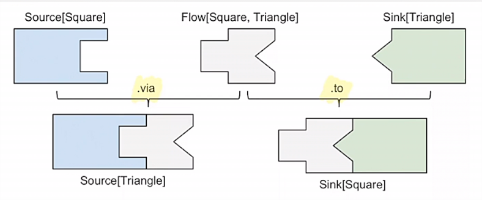
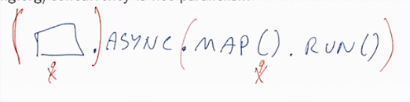
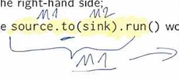

# Akka Streams

Высокоуровневый API для обработки стримов.

Имплементирует протокол реактивных стримов полностью.

## Пример

В процессе работы со стримами можно использовать как типиизрованные, так и обычные акторы. В этих лекциях используются нетипизированные.

```scala
import akka.actor._
import akka.stream.ActorMaterializer
import scala.concurrent.Future
import akka.stream.scaladsl.{Source, Flow, Sink}

object Hello extends App {
  implicit val system = ActorSystem()  // Для ActorMaterializer
  //implicit val mat = ActorMaterializer()  // Теперь имплиситно лежит в самой системе

  val eventuallyResult: Future[Int] = 
    Source(1 to 10)
      .map(_ * 2)
      .runFold(0)((acc, x) => acc + x)  // До этой линии поток ещё не запустился
      // методы с run обычно являются запускателями
}
```

Материализатор трансформирует описание пайплайна (eventuallyResult) в запущенный исполняемый поток. Сами по себе описания - это такие чертежи того, что должно быть выполнено.

## Sink

`runFold` - это синтаксический сахар для конструкции:

```scala
val eventuallyResult: Future[Int] = 
  Source(1 to 10)
    .map(_ * 2)
    .runWith(
      Sink.fold(0)((acc, x) => acc + x)
    )
```

Полное написание позволяет засунуть в runWith любую кастомную функцию.

## Flow

`.map` тоже можно извлечь в реюзабельный блок. Это называется Flow.

```scala
val numbers: Source[Int,NotUsed]    = Source(1 to 10)
val doubling: Flow[Int,Int,NotUsed] = Flow.fromFunction((x: Int) => x * 2)
val sum: Sink[Int,Future[Int]]      = Sink.fold(0)((acc: Int, x: Int) => acc + x)

val eventuallyResult: Future[Int] =
  numbers.via(doubling).runWith(sum)
```

## Шаги обработки

Шаги обработки называются **stages** (стадии). 

**Оператор** - DSL вроде `map`, `filter`, etc. Иногда мы называем стадии операторами.

Главные сущности Akka Stream:

- Source - 1 аутпут;
- Flow   - 1 инпут и 1 аутпут;
- Sink   - 1 инпут.

Эти сущности коррелируют с Java 9 имплементацией 1:1:

- `Source[O, _]` - `Publisher[O]`;
- `Sink[I, _]`   - `Subscriber[I]`;
- `Flow[I, O, _] - `Processor[I, O]`.

Шаги переходят из одного в другой так:

- `via` для пропускания через Flow;
- `to` для отправки в Sink.



## API

API Streams очень похоже на API коллекций Scala. Имеются те же операторы. Например:

```scala
tweets.filter(_.date < now).map(_.author)
```

Будет работать как в обычной коллекции, так и с правильными типами Streams.

## Модель вычислений 

ActorMaterializer может самостоятельно решать, *как* запускать потоки и даже применять оптимизации. Например, он сам решает, сколько потоков выделять на задачи. 

## Конкуренция это не параллелизм

Конкуренция - это композиция независимых процессов (например, стейджи выше). 

Параллелизм - это одновременное исполнение нескольких вычислений.

Стейджи по умолчанию конкурентны, но в зависимости от того, как они совмещаются - могут быть или не быть запущены параллельно.

Параллелизм форсит оператор `.async` либо `*Async` версии операторов (вроде `mapAsync`).

Например:



Всё, что в блоке до `.async` - будет выполнено на одном акторе, а остальное - на другом акторе.

## Материализованные значения

Почему благодаря `Sink` мы получили `Future[Int]` выше?

```scala
val sink: Sink[Int,Future[Int]] = Sink.fold(0)((acc: Int, x: Int) => acc + x)
```

Мы видели такую сигнатуру выше. Она говорит о следующем: Sink получает на вход Int и *материализует* его в Future[Int]. Материализованные значения (**mat-value**) - это значения, которые выдаёт (**yield**) текущий стейдж, когда мы запускаем стрим.

```scala
val eventuallyResult: Future[Int] =
  Source(1 to 10).runWith(sink)
```

`runWith` материализует sink-овое mat-value.

runWith принимает на вход только Sink (и обычно это и нужно). Но можно получать материализованные значения сурса:

```scala
source.to(sink).run()
```




## Доступ к материализованным значениям

Можно менять или получать доступ к материализованным значениям оператором пока стрим материализуется (прямо на ходу):

```scala
.mapMaterializedValue(mat => newMat)
```


