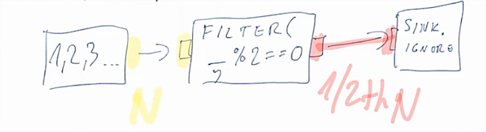

# Обработка неудач и скорость обработки

Обработка ошибок и настройка скорости обработки - это то, что делает потоки более мощным инструментом чем простые коллкции. 

Манифест реактивного программирования отличает неудачи (Failure) и ошибки (Error):

> Неудача - это неожиданное событие в сервисе, которое останавливает его работу.

> Ошибка - это ожидаемое событие (например, проваленная валидация формы), которое будет отправлена клиенту.

Из-за этого могут возникнуть проблемы с методами. Метод `onError` применяется в случае неудачи (Failure) стрима. 

Failure не являются типом стрима T, посылается вне границ (без запроса, не занимает место под элементы стрима в клиенте), является сигналом терминации (после него стрим ничего не отправляет).

Ошибки (Error), в свою очередь, являются частью типа. Например, `Flow[Validatable, ValidationResult, _]` представляет поток значений, которые должны быть валидированы. `Flow[Try[T], T, _]` - поток, фильтрующий Successful.

## Логирование и распространение

Неудачи идут только от потока к клиенту. Стейдж посылает вниз сигнал onError, а клиент наверх - cancel (если клиент вообще был).

Неудачи обычно остаются внутри стрима, но их можно доставать через материализацию (будет получаться **failed Future**).

Логировать можно подобным образом:

```scala
.log().withAttributes(ActorAttributes.logLevels(...))
```

Логирует все сигналы в этой точке.

Уровни логов:

- onNext;
- onError;
- onComplete.

## Восстановление после ошибок

Имеются методы для восстановления после ошибок:

- `recover[T](pf: PartialFunction[Throwable, T])`;
- `recoverWith[T](pf: PartialFunction[Throwable, Source[T, _]])` - по сути заменить стрим новым сурсом в какой-то специфичной неудаче, где это требуется;
- Перезапуск стейджа. Например, `RestartFlow.withBackoff`. Рестарт позволяет использовать **backoff**. Этот механизм позволяет выбрать количество рестартов и интервал, а также замену на случай повторных неудач.

## Скорость обработки

Скорость потока может отличаться в разных частях стрима. Например, если стрим состоит:

- Бесконечный источник номеров;
- Flow, фильтрующий только четные;
- Sink, принимающий всё пришедшее.



Очевидно, что выход Flow и вход Sink будут иметь частоту в два раза меньше, чем источник и вход Flow.

## Частотно-зависимые операторы

Некоторые операторы могут использоваться для работы с back-pressure:

- `conflate` - комбинирует элементы из источника *пока клиент приостанавливает получение (back-pressures)*. Вниз будет отослано скомбинированное значение вместо отдельных;
- `extrapolate` - если клиент быстрее, позволяет экстраполировать элементы из последнего увиденного элемента источника (не ждать источника, а предугадывать следующие элементы и кидать элементы вниз).

> Экстраполя́ция, экстраполи́рование — особый тип аппроксимации, при котором функция аппроксимируется вне заданного интервала, а не между заданными значениями. Иными словами, экстраполяция — приближённое определение значений функции в точках, лежащих вне отрезка, по её значениям в точках. 

