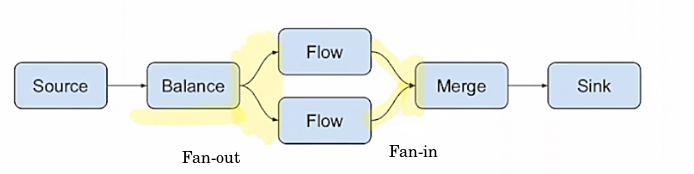
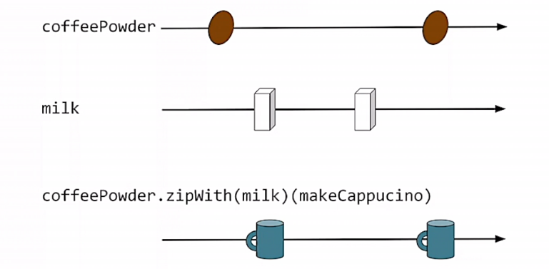

# Fan-in и Fan-out операции

Source, Flow и Sink позволяют только последовательные трансформации:

- Fan-in операции - это операции с *несколькими инпутами*;
- Fan-out операции - это операции с *несколькими аутпутами*.



## Merge - static fan-in

Merge - это статичная (static) fan-in операция:


Она позволяет совместить несколько источников без учёта порядка.

```scala
def coffees(
  mokaPot: Source[Coffee, _],
  frenchPress: Source[Coffee, _]
): Source[Coffee, _] =
  mokaPot.merge(frenchPress)
```

Мы просто получаем кофе из каждого источника по мере поступления в любом порядке. 

## ZipWith - static fan-in



Мержит два стрима так, что всегда требует по одному элементу от каждого стрима (мержит только парами). 

```scala
def cappuccinos(
  coffeePowderSource: Source[CoffeePowder, _],
  milkSource: Source[Milk, _]
): Source[Cappuccino, _] =
  coffeePowderSource.zipWith(milkSource) {
    case (coffeePowder, milk) => makeCappuccino(coffeePowder, milk)
  }
```

Мы создаём капучино только когда имеем по одному элементу каждого вида.

Что, если один из источников быстрее? Операция zipWith будет использовать back-pressure и перестанет запрашивать элементы из быстрого стрима.

## Balance - static fan-out


Balance позволяет сурсу распределять сообщения между двумя потоками.


## Broadcast - static fan-out


Копирует значения из одного потока в два приёмника.


## Dynamic fan-in и fan-out

Динамические fan-* операции позволяют менять количество входов-выходов в рантайме.

### Dynamic fan-in

- Количество портов Merge и ZipWith *фиксируется* описаниями в коде (графе);
- Иногда нужно менять их уже после запуска графа.

Например: фабрика кофе позволяет воркерам входить или выходить из линии производства.

```scala
class CoffeFactory()(implicit mat: Materializer) {
  private def warehouse(coffee: Coffee): Unit = ... // Хранение на складе

  private val workersHub = 
    MergeHub.source[Coffee]  // MergeHub это Source, мержащий много сурсов в один, но выдающий Sink в качестве материализованного 
      .to(Sink.foreach(warehouse))
      .run()   // : Sink[Coffee, _] - материализованное значение

  def connectWorker(worker: Source[Coffee, _]): Unit =
    worker.to(workersHub).run()  // Снаружи для воркеров workersHub выглядит как Sink. Воркеры это Source. Мы можем так коннектить.
}
```

workersHub - это Source, который ничего не производит, но возвращает материализованный Sink. Он по сути предоставляет доступ к тому, что производят другие источники. 

### Dynamic fan-out

```scala
private def warehouse: Flow[Coffee, StoredCoffee, _] = ...

private val (workersHub, customersHub) = 
  MergeHub.source[Coffee]
    .via(warehouse)
    .toMat(BroadcastHub.sink[StoredCoffee])(Keep.both)  // Материализуем оба 
    .run()

def connectWorker(worker: Source[Coffee, _]): Unit =
  worker.to(workersHub).run() 

def connectCustomer(customer: Sink[StoredCoffee, _]): Unit =
  customersHub.to(customer).run()

```

`BroadcastHub` - материализованное значение этого Sink - это Source. Получается, что он позволяет получать многим потокам своё содержимое через материализацию.


